- Aula de Ingles Special Class
	-
	- Teacher Marcela
	  Olá!
	  Segue o acesso de sua aula! 📚
	  https://us02web.zoom.us/j/81009765694?pwd=K6uXtibZwaGFJbm5QN6DEw5ydVrsgs.1
	  Não esqueça de ligar a câmera.
	  Passcode: times
	  SPECIAL 13H
		-
		- The theme of this special class is
		-
		- I take some notes about the class
		- Resolve crime class
		- Suspects and Investigtors
		-
		- Quais questoes um deitive perguntaria:
		  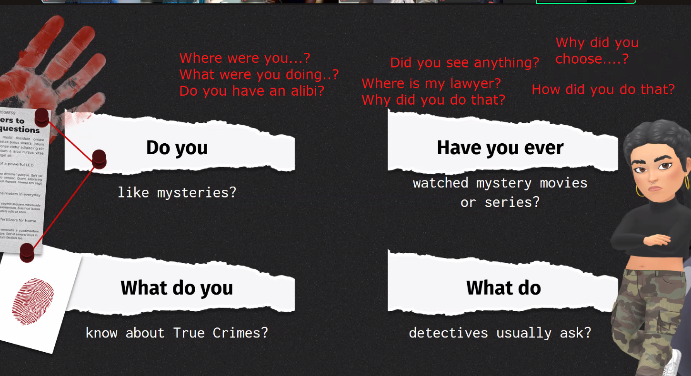
		-
		- 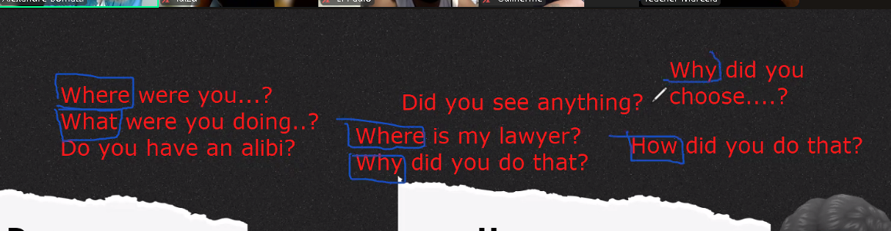
		  
		  Wh Question/Interrogative Pronouns
		-
		- Invesitgator mean
		  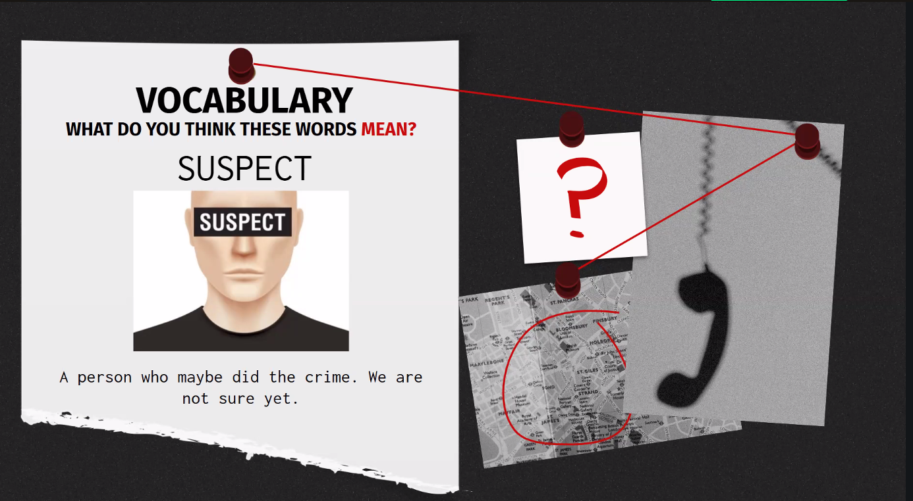
		-
		-
		- a claim or piece of evidence that one was elsewhere when an act, especially a criminal one, is alleged to have taken place.
		- 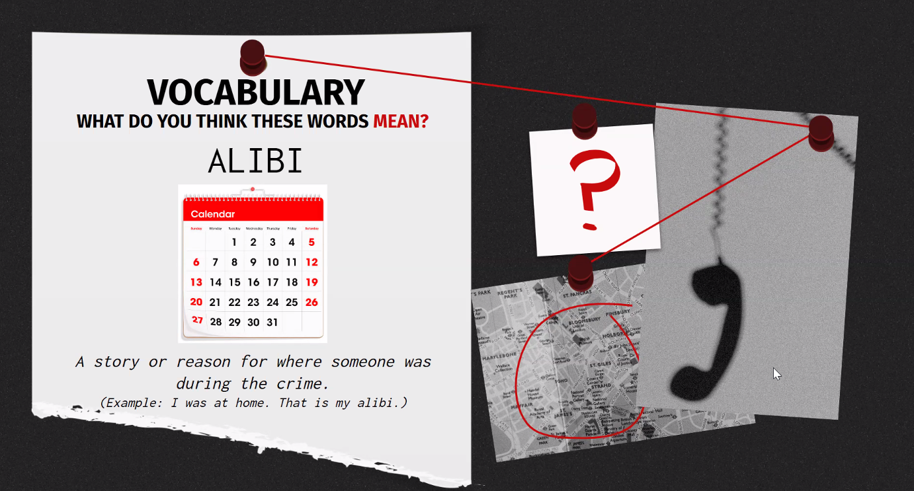
		-
		- Example: Yesterday im teching class, My students can prove my alibi
		-
		- Little lies series
		-
		- 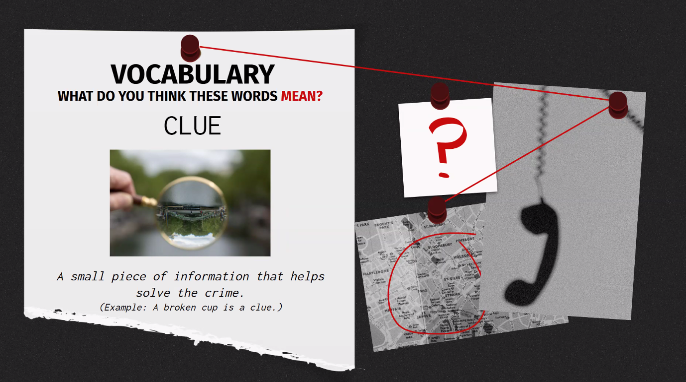
		- 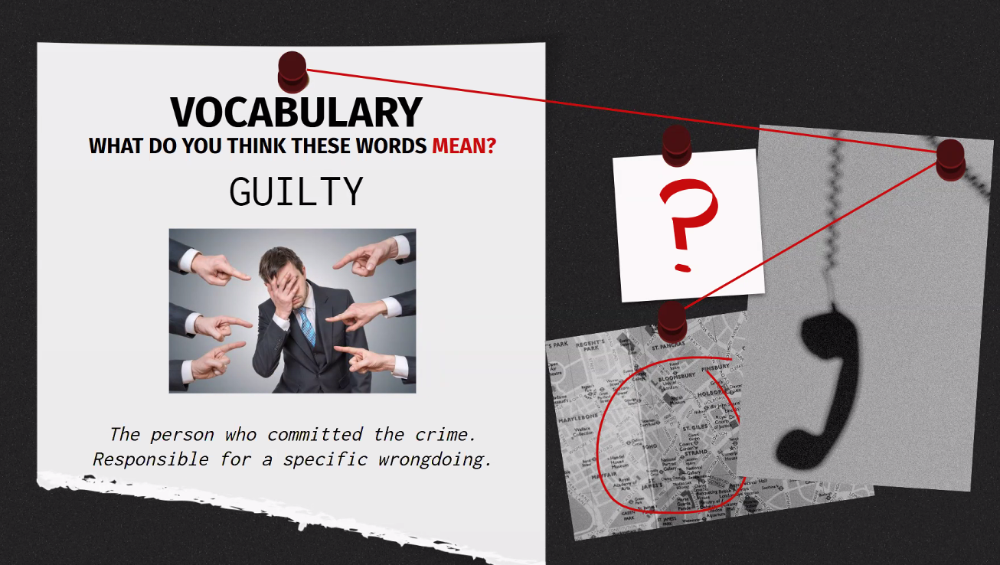
		- Nem sempre culpa é de crime e sim de sentimento ou responsabilidade
		-
		- 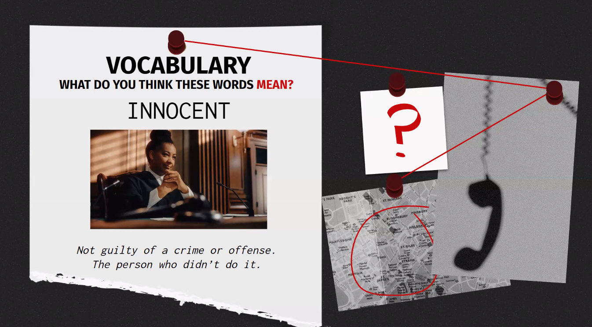
		-
		- 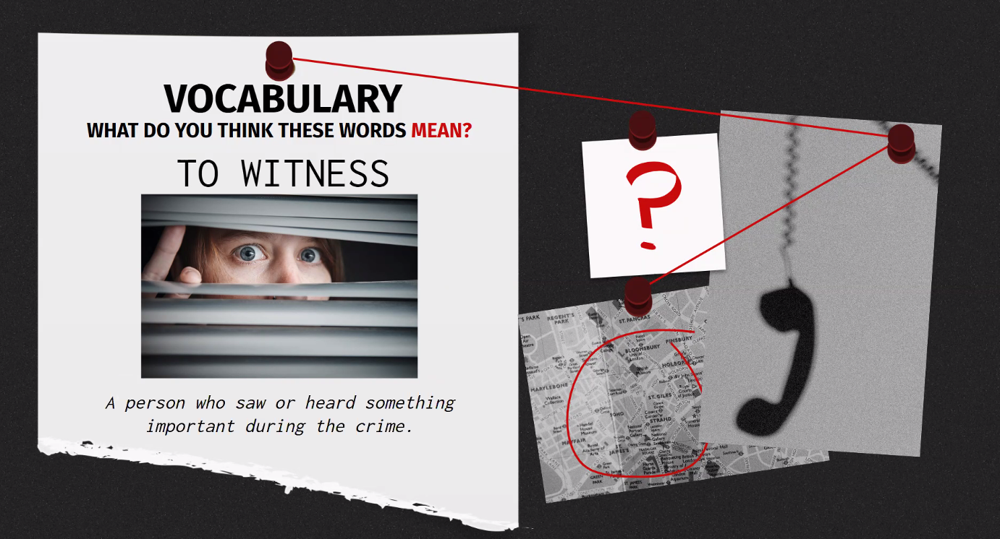
		- 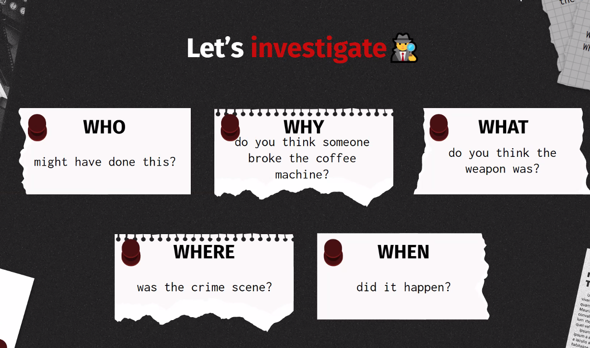
		- 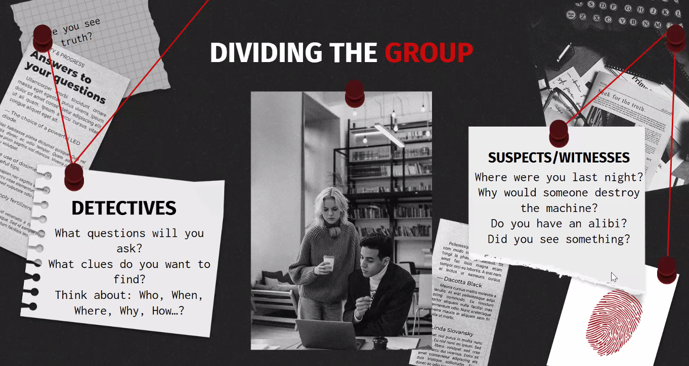
		- 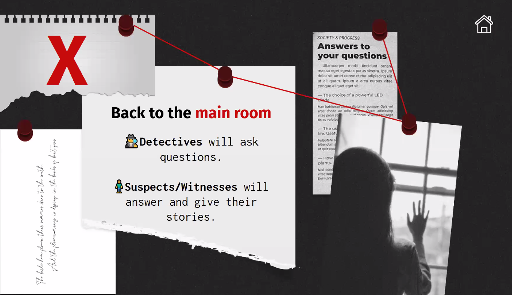
		- 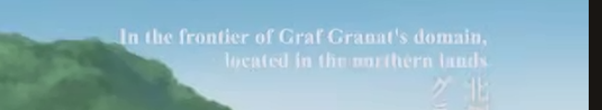
		-
	-
	-
-
-
- Teacher  Lucas Gabriel
  Olá!
  Segue o acesso de sua aula! 📚
  https://us02web.zoom.us/j/88943824511?pwd=TEp3S2thSlcvbCtXSWZtK3dZaWtLQT09
  senha: times
  Não esqueça de ligar a câmera.
  START 15H
- sair para passear com minha namorada -> go out for a walk with my girlfriend
- toothache - dor de cabeça
-
- 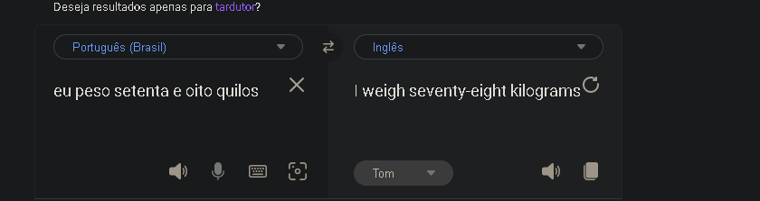
- 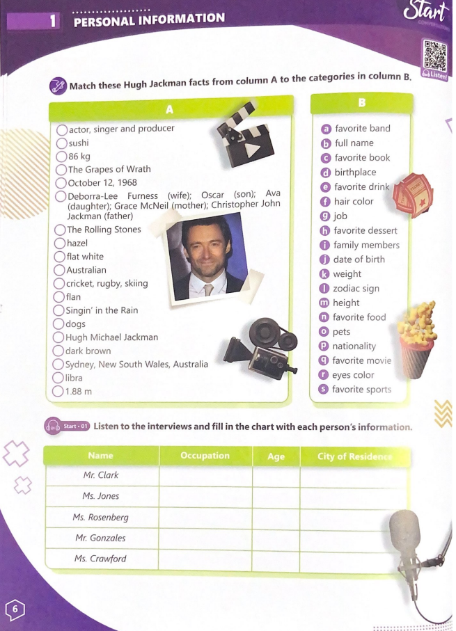
- Livro Just Talk Conversation book - no app é Leasson Start 01 (Book 1 - Leasson 4)
- Hazel is a eyes color
- Flat white is a drink with coffe (more milk than coffe)
- flan is a sobremesa pudding/pudim
- dyed my hair -> descolori o cabelo
-
- daughter
- neighbor
- Hugh (celebridade)
- pronuncia do "G" é mudo
- bittersweet (fun mas tbm sério)
-
-
-