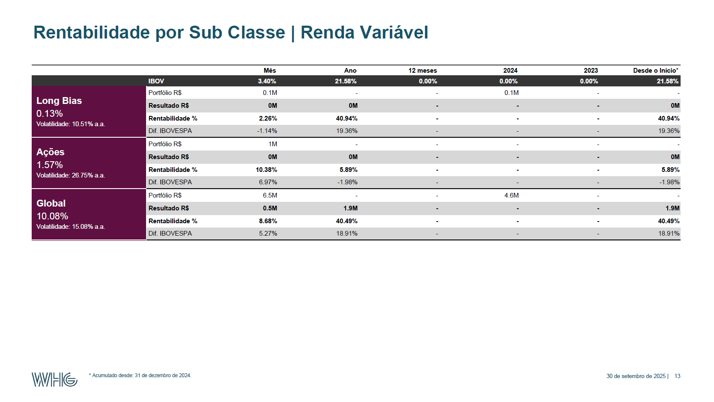
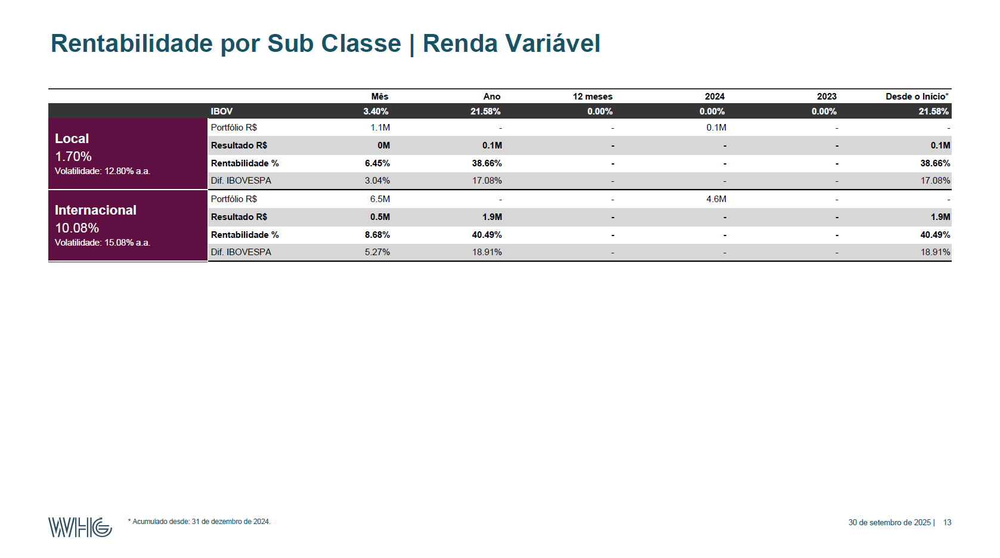
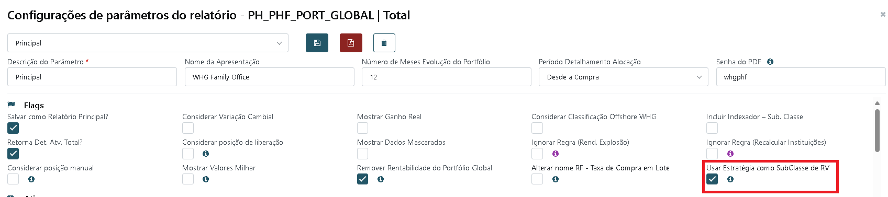

- PLD
	- As tarefas sao:
	- Mock de Dados nas APIs de PLD por Param/Flag True em TbAtivoGenerico
	- Criar parametro para uso de Validação do Número máximo de Requisições, é um Param/Flag True em TbAtivoGenerico (define valor maximo e ai ao calcular no popup puxamos esse valor por para ver se o calculado está dentro, no popup calculamos o numero de pessoa e o numero de regras a ser rodado, sendo cada regra uma api, sabemos a quantidade de chamadas)
-
- Todas as tarefas foram feitas, preciso Testar cada uma bem:
- Consolidação Flag de Quebra de Classe e Subclasse (10:52- 12:30)
	- 954643
	  WHG_2324046
-
- Vamos testar como é hoje em produção com a flag e sem a flag de "FlIsByEstrategiaAtivo"
-
- por {"FlIsByEstrategiaAtivo": "true"}, a classificação de Subclasse Renda Variável vai ser por Estratégia:
- Classificação RV por SubClasse - Estratégias
- 956369
- 
- C:\Users\matheus.dias\AppData\Local\Temp\tmpD932.pdf
-
- Se colocarmos como {"FlIsByEstrategiaAtivo": false}
- 954643
- Classificação RV por SubClasse - SubClasse
- 
- C:\Users\matheus.dias\AppData\Local\Temp\tmp15F8.pdf
- Então temos o Input e output/Resultados esperados ao alterar a Flag
-
- Antes de avaliar o teste de Início a fim, vamos validar em baby Steps
- Primeiro vamos validar se o Checkbox "IndClassificacaoRVPadrao" está sendo salvo nas configs do Banco
-
-
-
- Link da PR feita e os pontos mexidos em relação a Flag:
- TODO: Implementar Flag FlIsByEstrategiaAtivo
- [Commit baf49ba9: Merged PR 6169: Backlog Consolidação - Repos](https://dev.azure.com/WHG-Digital/Prisma/_git/Prisma_Service/commit/baf49ba995de5bec849da0ab17044456e63fbb5b?refName=refs/heads/main&_a=compare&path=/Core/Application/BSN/Consolidacao/ReportConsolidacaoBsn.cs)
-
-
-
- PLD Param de Mock de APIs
- PLD Param de Limite de Requets
- Desenvolver APIs Bureau de Dados
-
-
-
-
- 
-
- ``` json
  {"IdWalletPortfolio":1937,"TipoWalletPortfolio":"Carteira","CdCmd":"TST_WHG_2324046","Descricao":"Teste","NmApresentacao":null,"DescSenhaRelatorio":null,"KindReport":"Local","IndPrincipal":true,"IndExplodeTodosFundos":true,"NumMesesEvoPortfolio":6,"TpPeriodoResultadoDetalhamentoAlocacao":"since-buy","IndRetornaDetalhamentoAtivoTotal":true,"IndRetornaTabelaAtribPerformance":false,"IndConsideraVariacaoCambial":false,"IndMostraGanhoReal":false,"IndConsideraClassificaoOffshore":false,"IndClassificacaoRVPadrao":true,"IndIncluiIndexadoresPorSubClasse":false,"IndDadosMascarados":false,"IndConsiderarPosicaoManual":false,"IndConsiderarPosicaoLiberacao":false,"IndMostraValoresMilhar":false,"IndRemoveRentResulVolatil":false,"IndIgnorarRegraZeraVlrRendimentoExplosao":false,"IndIgnorarRegraExclusaoAtivoNivelMaior0OutrasInstituicoes":false,"IndUtilizaNomeTaxaCompraLote":false,"ExportOptionsPages":[{"DescPagina":"Overview","IndExportar":true,"NrOrdem":1},{"DescPagina":"Evolução do Portfólio | Local","IndExportar":true,"NrOrdem":41},{"DescPagina":"Histórico de Rentabilidade | Local","IndExportar":true,"NrOrdem":51},{"DescPagina":"Volatilidade Histórica | Local","IndExportar":false,"NrOrdem":55},{"DescPagina":"Resumo das Alocações | Local","IndExportar":true,"NrOrdem":61},{"DescPagina":"Atual x Sugerida | Local","IndExportar":false,"NrOrdem":71},{"DescPagina":"Rentabilidade por Instituição | Local","IndExportar":true,"NrOrdem":81},{"DescPagina":"Rentabilidade por Mandato | Local","IndExportar":false,"NrOrdem":85},{"DescPagina":"Rentabilidade por Classe | Local","IndExportar":true,"NrOrdem":91},{"DescPagina":"Rentabilidade por Classe | Instituição | Local","IndExportar":false,"NrOrdem":92},{"DescPagina":"Rentabilidade por Sub Classe | Local","IndExportar":true,"NrOrdem":101},{"DescPagina":"Rentabilidade por Sub Classe | Instituição | Local","IndExportar":true,"NrOrdem":102},{"DescPagina":"Cronograma de Vencimentos | Local","IndExportar":false,"NrOrdem":111},{"DescPagina":"Detalhamento | Cronograma de Vencimentos | Local","IndExportar":false,"NrOrdem":112},{"DescPagina":"Resumo dos Compromissos | Local","IndExportar":false,"NrOrdem":121},{"DescPagina":"Detalhamento dos Compromissos | Local","IndExportar":false,"NrOrdem":131},{"DescPagina":"Detalhamento dos Compromissos (TIR) | Local","IndExportar":false,"NrOrdem":133},{"DescPagina":"Matriz dos Compromissos | Local","IndExportar":false,"NrOrdem":136},{"DescPagina":"Maiores Exposições | Gestores (%) | Local","IndExportar":false,"NrOrdem":141},{"DescPagina":"Maiores Exposições | Emissores RF (%) | Local","IndExportar":false,"NrOrdem":151},{"DescPagina":"Maiores Exposições | Rating S&P RF (%) | Local","IndExportar":false,"NrOrdem":161},{"DescPagina":"Analítico de Renda Fixa | Local","IndExportar":false,"NrOrdem":171},{"DescPagina":"Duplicidade de Ativos | Local","IndExportar":true,"NrOrdem":181},{"DescPagina":"Detalhamento das Alocações | Local","IndExportar":true,"NrOrdem":191},{"DescPagina":"Atribuição de Performance por Ativo | Local","IndExportar":true,"NrOrdem":201},{"DescPagina":"Estudo Comparativo | Risco e Retorno | Local","IndExportar":false,"NrOrdem":211},{"DescPagina":"Informações Financeiras | Local","IndExportar":false,"NrOrdem":221},{"DescPagina":"Glossário","IndExportar":true,"NrOrdem":501}],"ExportOptionsExplosoes":[{"IdAtivo":861,"CdAtivo":"WHG INVESTMENT FOCUS FIC FIM CP","NmAtivo":"WHG INVESTMENT FOCUS FIC FIM CP","NrCnpj":"41.451.610/0001-99","IndExplode":true,"IndMantemAgrupamentoComprador":true,"DescAgrupador":null,"DicDescAgrupador":{},"DtInicioPeriodo":null,"DtFimPeriodo":null},{"IdAtivo":32157,"CdAtivo":"WHG BARBARESCO FIM CP","NmAtivo":"WHG BARBARESCO FIM CP","NrCnpj":"09.591.211/0001-10","IndExplode":true,"IndMantemAgrupamentoComprador":true,"DescAgrupador":null,"DicDescAgrupador":{},"DtInicioPeriodo":null,"DtFimPeriodo":null}],"ExportOptionsAtivos":null,"ExportOptionsBenchmark":{"TickerOffBenchName":null,"TickerOffBenchNameComparison":null,"TickerOffInflacao":null,"TickerOnBenchNameComparison":null,"TickerOnInflacao":null,"Configs":[{"IdIndex":5,"Index":null,"IndexComparisonType":"%","IndexComparison":null,"IndexComparisonPhrase":null,"IndexComparisonPhraseDisclaimer":null,"IndexComparisonPhraseDisclaimerInt":0,"IndexName":null,"FlPrincipal":true,"FlInflacao":false,"FlShowIndexDisclaimer":false,"KindReport":"Local","NrOrdem":1},{"IdIndex":23,"Index":null,"IndexComparisonType":"Dif","IndexComparison":null,"IndexComparisonPhrase":null,"IndexComparisonPhraseDisclaimer":null,"IndexComparisonPhraseDisclaimerInt":0,"IndexName":null,"FlPrincipal":false,"FlInflacao":false,"FlShowIndexDisclaimer":false,"KindReport":"Local","NrOrdem":2},{"IdIndex":3,"Index":null,"IndexComparisonType":"Dif","IndexComparison":null,"IndexComparisonPhrase":null,"IndexComparisonPhraseDisclaimer":null,"IndexComparisonPhraseDisclaimerInt":0,"IndexName":null,"FlPrincipal":false,"FlInflacao":false,"FlShowIndexDisclaimer":false,"KindReport":"Local","NrOrdem":3},{"IdIndex":4,"Index":null,"IndexComparisonType":"Dif","IndexComparison":null,"IndexComparisonPhrase":null,"IndexComparisonPhraseDisclaimer":null,"IndexComparisonPhraseDisclaimerInt":0,"IndexName":null,"FlPrincipal":false,"FlInflacao":false,"FlShowIndexDisclaimer":false,"KindReport":"Local","NrOrdem":4},{"IdIndex":8,"Index":null,"IndexComparisonType":"Dif","IndexComparison":null,"IndexComparisonPhrase":null,"IndexComparisonPhraseDisclaimer":null,"IndexComparisonPhraseDisclaimerInt":0,"IndexName":null,"FlPrincipal":false,"FlInflacao":false,"FlShowIndexDisclaimer":false,"KindReport":"Local","NrOrdem":5},{"IdIndex":2,"Index":null,"IndexComparisonType":"Dif","IndexComparison":null,"IndexComparisonPhrase":null,"IndexComparisonPhraseDisclaimer":null,"IndexComparisonPhraseDisclaimerInt":0,"IndexName":null,"FlPrincipal":false,"FlInflacao":false,"FlShowIndexDisclaimer":false,"KindReport":"Local","NrOrdem":6},{"IdIndex":27,"Index":null,"IndexComparisonType":"Dif","IndexComparison":null,"IndexComparisonPhrase":null,"IndexComparisonPhraseDisclaimer":null,"IndexComparisonPhraseDisclaimerInt":0,"IndexName":null,"FlPrincipal":false,"FlInflacao":false,"FlShowIndexDisclaimer":false,"KindReport":"Local","NrOrdem":7}],"IsInitialized":false},"ExportOptionsBookSubBook":[{"TpReport":"Classe","Book":null,"SubBook":null,"IdClasse":3,"IdSubClasse":0,"IdBancoContraparte":0,"KindReport":"Local","IdIndex":8,"Index":null,"IndExcluiBook":false,"DtInicioPeriodo":null,"DtFimPeriodo":null,"ListIdContraparteExcluir":null},{"TpReport":"SubClasse","Book":null,"SubBook":null,"IdClasse":4,"IdSubClasse":4,"IdBancoContraparte":0,"KindReport":"Local","IdIndex":2,"Index":null,"IndExcluiBook":false,"DtInicioPeriodo":null,"DtFimPeriodo":null,"ListIdContraparteExcluir":null}],"ExportOptionsAtivosExcluir":null,"ExportOptionsAtivosTotalExcluir":null}
  ```
-
- "C:\\Users\\matheus.dias\\AppData\\Local\\Temp\\tmp8359.pdf"
-
- Teste de nova flag:
- ```sql
  /*Id Fila de teste para laminas com Classificação RV - IdFila: 954643*/
  SELECT * FROM Tb_Fila_Processamento WHERE Id_Fila_Processamento_Status = 6
  
  /*Parametros do Relatório acima*/
  SELECT * FROM Tb_Configuracao WHERE Id_Configuracao = 31
  
  /*Nos Js_Opcoes abaixos oq muda é o "IndClassificacaoRVPadrao", nova flag para troca automática*/
  UPDATE Tb_Parametro_Consulta
  SET Js_Parametro = '{"IdWalletPortfolio":1976,"TipoWalletPortfolio":"Carteira","CdCmd":"WHG_2324046","Descricao":"Principal","NmApresentacao":"Relatório de Consolidação","DescSenhaRelatorio":null,"KindReport":"Local","IndPrincipal":true,"IndExplodeTodosFundos":true,"NumMesesEvoPortfolio":6,"TpPeriodoResultadoDetalhamentoAlocacao":"since-buy","IndRetornaDetalhamentoAtivoTotal":true,"IndRetornaTabelaAtribPerformance":false,"IndConsideraVariacaoCambial":false,"IndMostraGanhoReal":false,"IndConsideraClassificaoOffshore":false,"IndClassificacaoRVPadrao":false,"IndIncluiIndexadoresPorSubClasse":false,"IndDadosMascarados":false,"IndConsiderarPosicaoManual":false,"IndConsiderarPosicaoLiberacao":false,"IndMostraValoresMilhar":false,"IndRemoveRentResulVolatil":false,"IndIgnorarRegraZeraVlrRendimentoExplosao":false,"IndIgnorarRegraExclusaoAtivoNivelMaior0OutrasInstituicoes":false,"IndUtilizaNomeTaxaCompraLote":false,"ExportOptionsPages":[{"DescPagina":"Overview","IndExportar":true,"NrOrdem":1},{"DescPagina":"Evolução do Portfólio | Local","IndExportar":true,"NrOrdem":41},{"DescPagina":"Histórico de Rentabilidade | Local","IndExportar":true,"NrOrdem":51},{"DescPagina":"Volatilidade Histórica | Local","IndExportar":false,"NrOrdem":55},{"DescPagina":"Resumo das Alocações | Local","IndExportar":true,"NrOrdem":61},{"DescPagina":"Atual x Sugerida | Local","IndExportar":false,"NrOrdem":71},{"DescPagina":"Rentabilidade por Instituição | Local","IndExportar":true,"NrOrdem":81},{"DescPagina":"Rentabilidade por Mandato | Local","IndExportar":false,"NrOrdem":85},{"DescPagina":"Rentabilidade por Classe | Local","IndExportar":true,"NrOrdem":91},{"DescPagina":"Rentabilidade por Classe | Instituição | Local","IndExportar":false,"NrOrdem":92},{"DescPagina":"Rentabilidade por Sub Classe | Local","IndExportar":true,"NrOrdem":101},{"DescPagina":"Rentabilidade por Sub Classe | Instituição | Local","IndExportar":false,"NrOrdem":102},{"DescPagina":"Cronograma de Vencimentos | Local","IndExportar":false,"NrOrdem":111},{"DescPagina":"Detalhamento | Cronograma de Vencimentos | Local","IndExportar":false,"NrOrdem":112},{"DescPagina":"Resumo dos Compromissos | Local","IndExportar":false,"NrOrdem":121},{"DescPagina":"Detalhamento dos Compromissos | Local","IndExportar":false,"NrOrdem":131},{"DescPagina":"Matriz dos Compromissos | Local","IndExportar":false,"NrOrdem":136},{"DescPagina":"Maiores Exposições | Gestores (%) | Local","IndExportar":false,"NrOrdem":141},{"DescPagina":"Maiores Exposições | Emissores RF (%) | Local","IndExportar":false,"NrOrdem":151},{"DescPagina":"Maiores Exposições | Rating S&P RF (%) | Local","IndExportar":false,"NrOrdem":161},{"DescPagina":"Analítico de Renda Fixa | Local","IndExportar":false,"NrOrdem":171},{"DescPagina":"Duplicidade de Ativos | Local","IndExportar":false,"NrOrdem":181},{"DescPagina":"Detalhamento das Alocações | Local","IndExportar":true,"NrOrdem":191},{"DescPagina":"Atribuição de Performance por Ativo | Local","IndExportar":true,"NrOrdem":201},{"DescPagina":"Estudo Comparativo | Risco e Retorno | Local","IndExportar":false,"NrOrdem":211},{"DescPagina":"Informações Financeiras | Local","IndExportar":false,"NrOrdem":221},{"DescPagina":"Glossário","IndExportar":true,"NrOrdem":501}],"ExportOptionsExplosoes":[{"IdAtivo":861,"CdAtivo":"WHG INVESTMENT FOCUS FIC FIM CP","NmAtivo":"WHG INVESTMENT FOCUS FIC FIM CP","NrCnpj":"41.451.610/0001-99","IndExplode":true,"IndMantemAgrupamentoComprador":true,"DescAgrupador":null,"DicDescAgrupador":{},"DtInicioPeriodo":null,"DtFimPeriodo":null},{"IdAtivo":868,"CdAtivo":"WHG INVESTMENT FOCUS MASTER FIM CP","NmAtivo":"WHG INVESTMENT FOCUS MASTER FIM CP","NrCnpj":"41.391.014/0001-60","IndExplode":true,"IndMantemAgrupamentoComprador":true,"DescAgrupador":null,"DicDescAgrupador":{},"DtInicioPeriodo":null,"DtFimPeriodo":null},{"IdAtivo":32157,"CdAtivo":"WHG BARBARESCO FIM CP","NmAtivo":"WHG BARBARESCO FIM CP","NrCnpj":"09.591.211/0001-10","IndExplode":true,"IndMantemAgrupamentoComprador":false,"DescAgrupador":null,"DicDescAgrupador":{},"DtInicioPeriodo":null,"DtFimPeriodo":null}],"ExportOptionsAtivos":null,"ExportOptionsBenchmark":{"TickerOffBenchName":null,"TickerOffBenchNameComparison":null,"TickerOffInflacao":null,"TickerOnBenchNameComparison":null,"TickerOnInflacao":null,"Configs":[{"IdIndex":5,"Index":null,"IndexComparisonType":"%","IndexComparison":null,"IndexComparisonPhrase":null,"IndexComparisonPhraseDisclaimer":null,"IndexComparisonPhraseDisclaimerInt":0,"IndexName":null,"FlPrincipal":true,"FlInflacao":false,"FlShowIndexDisclaimer":false,"KindReport":"Local","NrOrdem":1},{"IdIndex":23,"Index":null,"IndexComparisonType":"Dif","IndexComparison":null,"IndexComparisonPhrase":null,"IndexComparisonPhraseDisclaimer":null,"IndexComparisonPhraseDisclaimerInt":0,"IndexName":null,"FlPrincipal":false,"FlInflacao":false,"FlShowIndexDisclaimer":false,"KindReport":"Local","NrOrdem":2},{"IdIndex":3,"Index":null,"IndexComparisonType":"Dif","IndexComparison":null,"IndexComparisonPhrase":null,"IndexComparisonPhraseDisclaimer":null,"IndexComparisonPhraseDisclaimerInt":0,"IndexName":null,"FlPrincipal":false,"FlInflacao":false,"FlShowIndexDisclaimer":false,"KindReport":"Local","NrOrdem":3},{"IdIndex":4,"Index":null,"IndexComparisonType":"Dif","IndexComparison":null,"IndexComparisonPhrase":null,"IndexComparisonPhraseDisclaimer":null,"IndexComparisonPhraseDisclaimerInt":0,"IndexName":null,"FlPrincipal":false,"FlInflacao":false,"FlShowIndexDisclaimer":false,"KindReport":"Local","NrOrdem":4},{"IdIndex":8,"Index":null,"IndexComparisonType":"Dif","IndexComparison":null,"IndexComparisonPhrase":null,"IndexComparisonPhraseDisclaimer":null,"IndexComparisonPhraseDisclaimerInt":0,"IndexName":null,"FlPrincipal":false,"FlInflacao":false,"FlShowIndexDisclaimer":false,"KindReport":"Local","NrOrdem":5},{"IdIndex":2,"Index":null,"IndexComparisonType":"Dif","IndexComparison":null,"IndexComparisonPhrase":null,"IndexComparisonPhraseDisclaimer":null,"IndexComparisonPhraseDisclaimerInt":0,"IndexName":null,"FlPrincipal":false,"FlInflacao":false,"FlShowIndexDisclaimer":false,"KindReport":"Local","NrOrdem":6},{"IdIndex":27,"Index":null,"IndexComparisonType":"Dif","IndexComparison":null,"IndexComparisonPhrase":null,"IndexComparisonPhraseDisclaimer":null,"IndexComparisonPhraseDisclaimerInt":0,"IndexName":null,"FlPrincipal":false,"FlInflacao":false,"FlShowIndexDisclaimer":false,"KindReport":"Local","NrOrdem":7}],"IsInitialized":false},"ExportOptionsBookSubBook":[{"TpReport":"Classe","Book":null,"SubBook":null,"IdClasse":3,"IdSubClasse":0,"IdBancoContraparte":0,"KindReport":"Local","IdIndex":8,"Index":null,"IndExcluiBook":false,"DtInicioPeriodo":null,"DtFimPeriodo":null,"ListIdContraparteExcluir":null},{"TpReport":"SubClasse","Book":null,"SubBook":null,"IdClasse":4,"IdSubClasse":4,"IdBancoContraparte":0,"KindReport":"Local","IdIndex":2,"Index":null,"IndExcluiBook":false,"DtInicioPeriodo":null,"DtFimPeriodo":null,"ListIdContraparteExcluir":null}],"ExportOptionsAtivosExcluir":null,"ExportOptionsAtivosTotalExcluir":null}'
  WHERE Id_Parametro  = 1165
  
  UPDATE Tb_Parametro_Consulta
  SET Js_Parametro = '{"IdWalletPortfolio":1976,"TipoWalletPortfolio":"Carteira","CdCmd":"WHG_2324046","Descricao":"Principal","NmApresentacao":"Relatório de Consolidação","DescSenhaRelatorio":null,"KindReport":"Local","IndPrincipal":true,"IndExplodeTodosFundos":true,"NumMesesEvoPortfolio":6,"TpPeriodoResultadoDetalhamentoAlocacao":"since-buy","IndRetornaDetalhamentoAtivoTotal":true,"IndRetornaTabelaAtribPerformance":false,"IndConsideraVariacaoCambial":false,"IndMostraGanhoReal":false,"IndConsideraClassificaoOffshore":false,"IndClassificacaoRVPadrao":true,"IndIncluiIndexadoresPorSubClasse":false,"IndDadosMascarados":false,"IndConsiderarPosicaoManual":false,"IndConsiderarPosicaoLiberacao":false,"IndMostraValoresMilhar":false,"IndRemoveRentResulVolatil":false,"IndIgnorarRegraZeraVlrRendimentoExplosao":false,"IndIgnorarRegraExclusaoAtivoNivelMaior0OutrasInstituicoes":false,"IndUtilizaNomeTaxaCompraLote":false,"ExportOptionsPages":[{"DescPagina":"Overview","IndExportar":true,"NrOrdem":1},{"DescPagina":"Evolução do Portfólio | Local","IndExportar":true,"NrOrdem":41},{"DescPagina":"Histórico de Rentabilidade | Local","IndExportar":true,"NrOrdem":51},{"DescPagina":"Volatilidade Histórica | Local","IndExportar":false,"NrOrdem":55},{"DescPagina":"Resumo das Alocações | Local","IndExportar":true,"NrOrdem":61},{"DescPagina":"Atual x Sugerida | Local","IndExportar":false,"NrOrdem":71},{"DescPagina":"Rentabilidade por Instituição | Local","IndExportar":true,"NrOrdem":81},{"DescPagina":"Rentabilidade por Mandato | Local","IndExportar":false,"NrOrdem":85},{"DescPagina":"Rentabilidade por Classe | Local","IndExportar":true,"NrOrdem":91},{"DescPagina":"Rentabilidade por Classe | Instituição | Local","IndExportar":false,"NrOrdem":92},{"DescPagina":"Rentabilidade por Sub Classe | Local","IndExportar":true,"NrOrdem":101},{"DescPagina":"Rentabilidade por Sub Classe | Instituição | Local","IndExportar":false,"NrOrdem":102},{"DescPagina":"Cronograma de Vencimentos | Local","IndExportar":false,"NrOrdem":111},{"DescPagina":"Detalhamento | Cronograma de Vencimentos | Local","IndExportar":false,"NrOrdem":112},{"DescPagina":"Resumo dos Compromissos | Local","IndExportar":false,"NrOrdem":121},{"DescPagina":"Detalhamento dos Compromissos | Local","IndExportar":false,"NrOrdem":131},{"DescPagina":"Matriz dos Compromissos | Local","IndExportar":false,"NrOrdem":136},{"DescPagina":"Maiores Exposições | Gestores (%) | Local","IndExportar":false,"NrOrdem":141},{"DescPagina":"Maiores Exposições | Emissores RF (%) | Local","IndExportar":false,"NrOrdem":151},{"DescPagina":"Maiores Exposições | Rating S&P RF (%) | Local","IndExportar":false,"NrOrdem":161},{"DescPagina":"Analítico de Renda Fixa | Local","IndExportar":false,"NrOrdem":171},{"DescPagina":"Duplicidade de Ativos | Local","IndExportar":false,"NrOrdem":181},{"DescPagina":"Detalhamento das Alocações | Local","IndExportar":true,"NrOrdem":191},{"DescPagina":"Atribuição de Performance por Ativo | Local","IndExportar":true,"NrOrdem":201},{"DescPagina":"Estudo Comparativo | Risco e Retorno | Local","IndExportar":false,"NrOrdem":211},{"DescPagina":"Informações Financeiras | Local","IndExportar":false,"NrOrdem":221},{"DescPagina":"Glossário","IndExportar":true,"NrOrdem":501}],"ExportOptionsExplosoes":[{"IdAtivo":861,"CdAtivo":"WHG INVESTMENT FOCUS FIC FIM CP","NmAtivo":"WHG INVESTMENT FOCUS FIC FIM CP","NrCnpj":"41.451.610/0001-99","IndExplode":true,"IndMantemAgrupamentoComprador":true,"DescAgrupador":null,"DicDescAgrupador":{},"DtInicioPeriodo":null,"DtFimPeriodo":null},{"IdAtivo":868,"CdAtivo":"WHG INVESTMENT FOCUS MASTER FIM CP","NmAtivo":"WHG INVESTMENT FOCUS MASTER FIM CP","NrCnpj":"41.391.014/0001-60","IndExplode":true,"IndMantemAgrupamentoComprador":true,"DescAgrupador":null,"DicDescAgrupador":{},"DtInicioPeriodo":null,"DtFimPeriodo":null},{"IdAtivo":32157,"CdAtivo":"WHG BARBARESCO FIM CP","NmAtivo":"WHG BARBARESCO FIM CP","NrCnpj":"09.591.211/0001-10","IndExplode":true,"IndMantemAgrupamentoComprador":false,"DescAgrupador":null,"DicDescAgrupador":{},"DtInicioPeriodo":null,"DtFimPeriodo":null}],"ExportOptionsAtivos":null,"ExportOptionsBenchmark":{"TickerOffBenchName":null,"TickerOffBenchNameComparison":null,"TickerOffInflacao":null,"TickerOnBenchNameComparison":null,"TickerOnInflacao":null,"Configs":[{"IdIndex":5,"Index":null,"IndexComparisonType":"%","IndexComparison":null,"IndexComparisonPhrase":null,"IndexComparisonPhraseDisclaimer":null,"IndexComparisonPhraseDisclaimerInt":0,"IndexName":null,"FlPrincipal":true,"FlInflacao":false,"FlShowIndexDisclaimer":false,"KindReport":"Local","NrOrdem":1},{"IdIndex":23,"Index":null,"IndexComparisonType":"Dif","IndexComparison":null,"IndexComparisonPhrase":null,"IndexComparisonPhraseDisclaimer":null,"IndexComparisonPhraseDisclaimerInt":0,"IndexName":null,"FlPrincipal":false,"FlInflacao":false,"FlShowIndexDisclaimer":false,"KindReport":"Local","NrOrdem":2},{"IdIndex":3,"Index":null,"IndexComparisonType":"Dif","IndexComparison":null,"IndexComparisonPhrase":null,"IndexComparisonPhraseDisclaimer":null,"IndexComparisonPhraseDisclaimerInt":0,"IndexName":null,"FlPrincipal":false,"FlInflacao":false,"FlShowIndexDisclaimer":false,"KindReport":"Local","NrOrdem":3},{"IdIndex":4,"Index":null,"IndexComparisonType":"Dif","IndexComparison":null,"IndexComparisonPhrase":null,"IndexComparisonPhraseDisclaimer":null,"IndexComparisonPhraseDisclaimerInt":0,"IndexName":null,"FlPrincipal":false,"FlInflacao":false,"FlShowIndexDisclaimer":false,"KindReport":"Local","NrOrdem":4},{"IdIndex":8,"Index":null,"IndexComparisonType":"Dif","IndexComparison":null,"IndexComparisonPhrase":null,"IndexComparisonPhraseDisclaimer":null,"IndexComparisonPhraseDisclaimerInt":0,"IndexName":null,"FlPrincipal":false,"FlInflacao":false,"FlShowIndexDisclaimer":false,"KindReport":"Local","NrOrdem":5},{"IdIndex":2,"Index":null,"IndexComparisonType":"Dif","IndexComparison":null,"IndexComparisonPhrase":null,"IndexComparisonPhraseDisclaimer":null,"IndexComparisonPhraseDisclaimerInt":0,"IndexName":null,"FlPrincipal":false,"FlInflacao":false,"FlShowIndexDisclaimer":false,"KindReport":"Local","NrOrdem":6},{"IdIndex":27,"Index":null,"IndexComparisonType":"Dif","IndexComparison":null,"IndexComparisonPhrase":null,"IndexComparisonPhraseDisclaimer":null,"IndexComparisonPhraseDisclaimerInt":0,"IndexName":null,"FlPrincipal":false,"FlInflacao":false,"FlShowIndexDisclaimer":false,"KindReport":"Local","NrOrdem":7}],"IsInitialized":false},"ExportOptionsBookSubBook":[{"TpReport":"Classe","Book":null,"SubBook":null,"IdClasse":3,"IdSubClasse":0,"IdBancoContraparte":0,"KindReport":"Local","IdIndex":8,"Index":null,"IndExcluiBook":false,"DtInicioPeriodo":null,"DtFimPeriodo":null,"ListIdContraparteExcluir":null},{"TpReport":"SubClasse","Book":null,"SubBook":null,"IdClasse":4,"IdSubClasse":4,"IdBancoContraparte":0,"KindReport":"Local","IdIndex":2,"Index":null,"IndExcluiBook":false,"DtInicioPeriodo":null,"DtFimPeriodo":null,"ListIdContraparteExcluir":null}],"ExportOptionsAtivosExcluir":null,"ExportOptionsAtivosTotalExcluir":null}'
  WHERE Id_Parametro  = 1165
  
  
  
  
  
  ```
-
- Revisar Mock PLD
- Revisar Limite PLD
- Revisar tela de Bureau
-
-
-