- Ajustar pontos Nat (17:40)
	- Campo abaixo não retorna nada CORRIGIDO
	-
	- Identificar qual API corresponde ao "Buscar Empresa por Nome" OK
	- Testar API direto no Postman com alguns possíveis clientes de Input OK
	- Verificar se temos retorno OK
	- 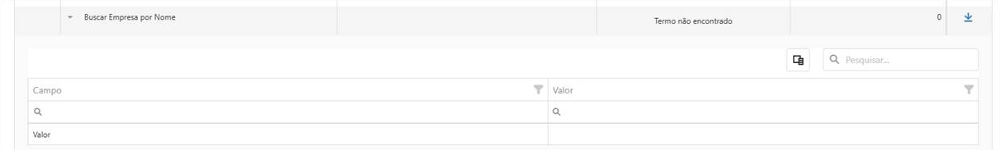
	-
	- O Filtro abaixo não tá trazendo os links nas matérias na mídia em que a empresa consultada foi mencionada. (Que filtro ? Testei Petro e retornou links ())
	- 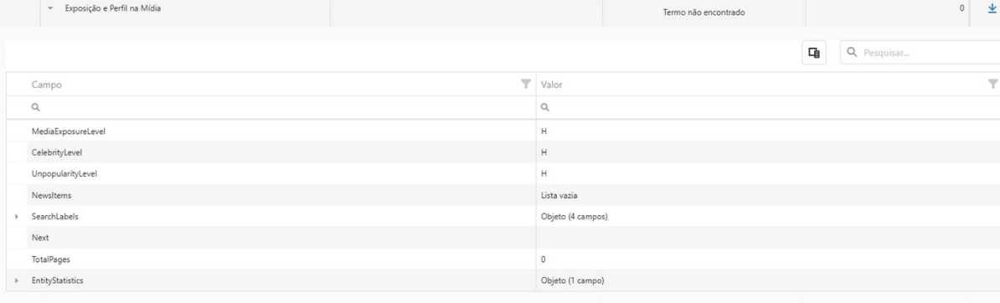
	- Exemplo funcionando:
	- 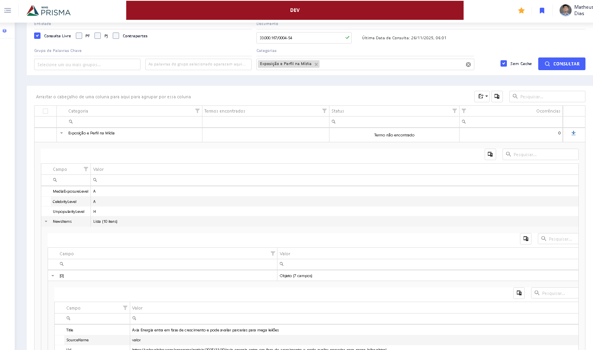
	- Obs: olhando na doc, vi que é necessário ter paginação nesse caso:
	  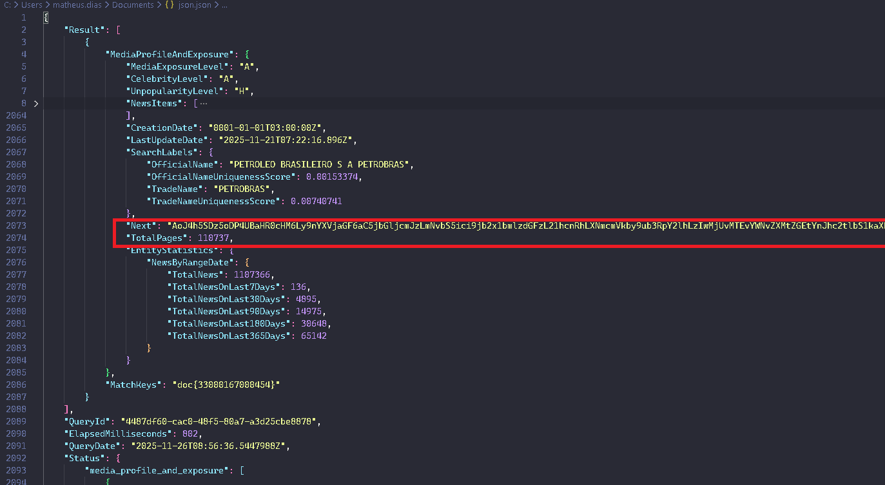
	- [Exposição e Perfil na Mídia](https://docs.bigdatacorp.com.br/plataforma/reference/pessoas_media_profile_and_exposure)
	- 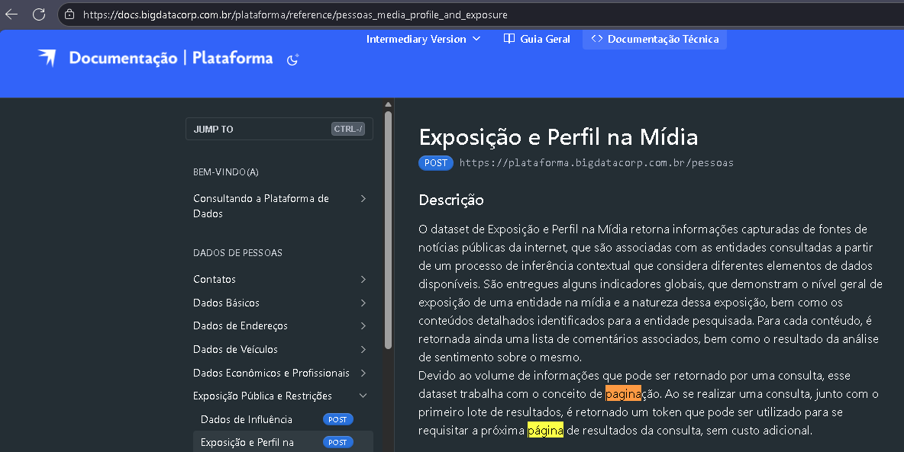
	- 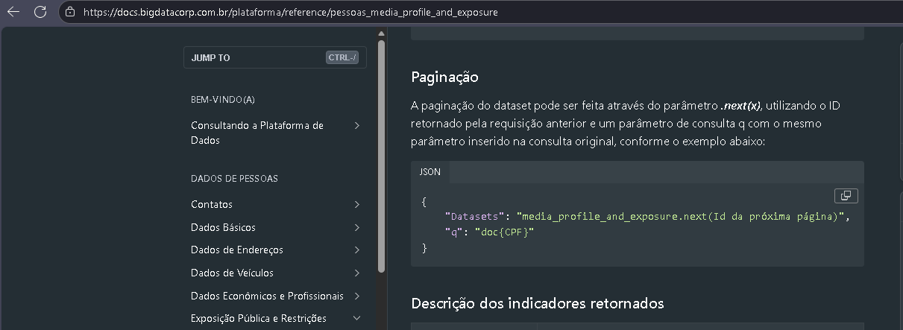
	-
	-
	-
	- Traz somente 100 resultados, mas e determinados casos, o cliente tem mais de 100 processos. OK
	- 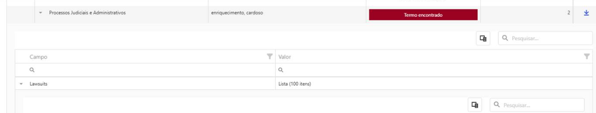{:height 236, :width 1195}
	- Aqui tá confuso. São dados diferentes mesmo? OK
		- 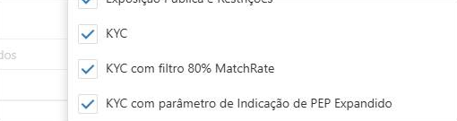
	- O campo abaixo (pra PF e PJ, não retorna nada. (É uma API apenas de PJ, e retorna dados em casos de grandes empresas pegando do reclame aqui) OK
		- 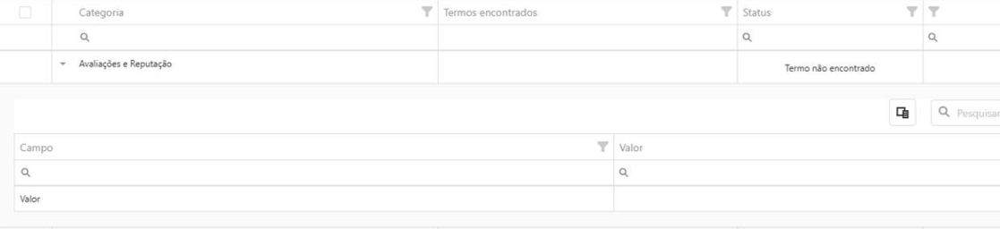
	- O campo abaixo, em PF, está vindo vazio. OK
	- 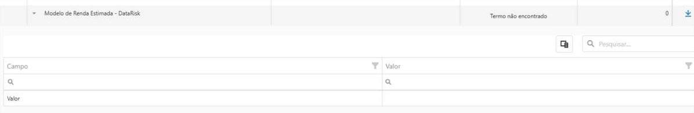
	-
- Nos itens abaixo,  seria possível deixar o resultado na tela no formato da planilha que tem pra exportar? É um formato mais resumido, e mais fácil de visualização. Na verdade, é o formato que já está no Prisma em produção hoje.
- 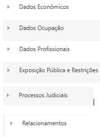