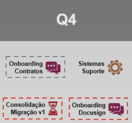
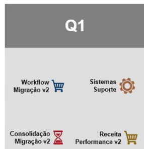
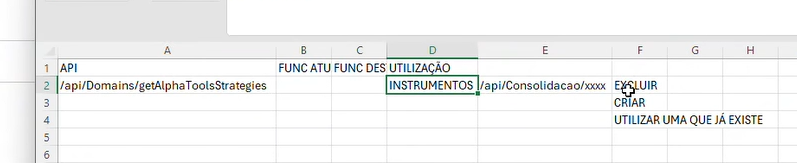

## **Issue**: Migração do Sistema de Consolidação
-
- ### **Objetivo**
- Migrar o Sistema de Consolidação da plataforma OutSystems para o Prisma, incorporando-o como um novo módulo do sistema.
-
- ### **Contexto**
- Na análise dos custos de TI, identificou-se que aproximadamente **45% das despesas da área estão relacionadas à plataforma OutSystems**. Embora ela tenha sido importante no passado para ganho de agilidade, hoje já temos maturidade técnica para **descomissionar esse low-code** e **reconstruir toda a camada de UI, Controller Acessos do módulo de Consolidação diretamente no Prisma (via código)**. Com isso, poderemos **encerrar o contrato com a OutSystems**, **reduzir significativamente os custos** e **unificar o uso do time de Consolidação apenas no Prisma**, deixando a solução mais simples, padronizada e enxuta. Após o decomissionamento, faremos o Detach/Quebra de Contrato com a Outsystems (e podemos pegar os códigos React e C#). Contrato com a OutSystems temrina em Junho de 2026.
-
- ### Planejamento Estratégico TBD
- Nov - Dez 2025 Q4 Etapa 1 - Consolidação V1
- Planejamento e Migrar funções Principais
- 
  
  Jan - Março 2026:
- Q2 Etapa 2 - Consolidação V2
- Migrar demais funcionalidades e testar
- 
-
- Abr - Jun 2026:
- Q3 Etapa 3 Teste de Fogo do novo módulo de Consolidação no Prisma e Decomissionamento
-
- ### Considerações:
- O Backend do Sistema de Consolidação já está no Backend do Sistema Prisma (Camadas de Lógica e Modelagem de Entidades não precisam de reestruturação).
- O principal agora será migrar as Controllers de Consolidação do Prisma External para Controllers do Prisma Service (Entrypoint)
- Ao mesmo tempo que se migra as Controllers, também deve ser mapeado os novos Acessos.
- Criar uma única Controller chamada Consolidação (Pois uma Controller do Backend pode estar atrelada a mais de um Componente no FrontEnd)
- Ao estruturar o Backend na parte da controller, já imaginar como vai ser a estrutura do Frontend (Menu, Telas, Funções -> pq ai ja pensamos em Componentes e Funcionalidades já pensamos nos registros das APIs que tem que ser cadastradas)
- Então para o Will a Primeira etapa é estruturação com Backend com a Casca do Frontend (Etapas 1,2 e 3)
- Ao mesmo tempo que faço as etapas 1,2 e 3 eu olho tbm o documento de acessos que havia feito previamente com o Will, pois as funções de Consolidação que pomos lá nesse documento de Acessos anteriormente vao cair/vamos criar novos acessos
- Tudo que for Instrumento, ignorar
- Portfolios e Carteiras vamos migrar só a parte de Cadastro, coisas como processamento vamos manter na Out por enquanto
- Coluna Controller coloca a controller nova ou que já existe
-
- Obs: Desindratação (Instrumentos Mak ja fez a maioria)
- ---
- ### Issue Migração
- #### Tarefas Planejadas:
-
- ##### Etapa 1
- 1 - Mapeamento (Front e Back)
  2 - Estrutura Back (Somente de Controller e Acessos, BSNs e Entidades não mudam)
  3 - Estrutura Front (Menu, Telas, Funções)
-
- 4 - Planejamento da desidratação das telas/funções
- 5 - Cadastro pt.1 (Carteiras, Portfólios)
- 6- Cadastro pt.2 (Instrumentos mas Mak pega)
  7- Boletas pt.1 (Movs, Funções)
  8- Boletas pt.2 (Motor, Replicações e Recon)
  9- Relatórios pt.1 (Liberação e Processamento)
-
- ##### Etapa 2
- 10- Relatórios pt.2 (Funções e Tela c/ gráficos)
  11- Ranking de Portfólios
-
- Algumas APIs vamos excluir ou utilizar que ja sao usadas no prisma (pois ja sao comtempladas no prisma)
- 
-
- PRISMA EXTERNAL X PRISMA SERVICE
-
- EXCLUIR -> API EXISTENTE NO PRISMA EXTERNAL, MAS NÃO É MAIS NECESSÁRIA, **EXCLUIR** NO EXTERNAL
- CRIAR/MIGRAR -> API NO PRISMA EXTERNAL MAS NAO EXISTE LÓGICA EQUIVALENTE NO PRISMA SERVICE, **MIGRAR** PARA O PRISMA SERVICE
- UTILIZAR ->API QUE JÁ TEM LÓGICA EQUIVALENTE E NAO É NECESSÁRIO CRIAR NOVA API NO PRISMA SERVICE, **UTILIZAR QUE JÁ EXISTE** NO PRISMA SERVICE
-
-
-
-
-
-
-
-
-
-
-
-