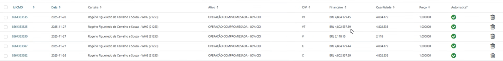
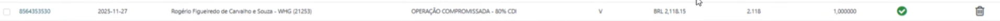

- Compliance
	- Bureau de Dados, exemplo de PEP que é sancionado mas não apresenta histórico OK
	- Tela de Contas verificar pq Contas de Dezembro nao aparecerem a Dt de Assinatura OK
	- Provento verificar pq veio errado (TEPP11 e HFOF11), pegar oq deu errado (TEPP11) e entender pq veio grupamento invés de desdobramento vindo do AT
-
- Suporte Vini verificar lógica das boletas
- 
-
- Essa **não** deveria existir:
- 
-
-
-
-
-
-