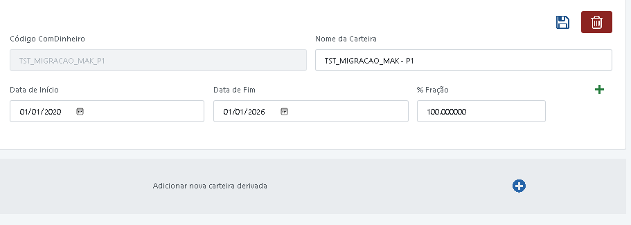

- {
    "idCarteira": 0,
    "cdCarteiraComDinheiro": "TST_MIGRACAO_1",
    "nmCarteira": "TST_MIGRACAO_1",
    "idBancoContraparte": 167,
    "idCliente": 1128,
    "idAtivo": 586,
    "idUsu": "matheus.dias",
    "idMoeda": 1,
    "descAgrupador": "Agrupador",
    "codRelatorio": "CONTA | WHG MAK",
    "dtInicio": "2020-01-01",
    "tpFonte": "MOVIMENTACAOXP",
    "dtCorteReplicacaoMovimentacao": "2020-02-01",
    "flIgnorarBoletaGrossUpCalculoPosicao": true,
    "dtFim": "2026-08-01",
    "descMandato": "WHG Mandato",
    "idPerfilCarteira": 0,
    "idPerfilTributario": 0,
    "idCalendario": 0,
    "idCadastroAutomaticoProventos": "1",
    "idCadastroAutomaticoVencimentos": "1",
    "dtCadastroAutomatico": "1900-01-01",
    "impedeMudancas": false,
    "discriminaCaixa": false,
    "dtImpedeMudancas": "1900-01-01",
    "dtAcompanhamento": "1900-01-01",
    "gerente": "",
    "omitirRetornos": false,
    "disclamer": "",
    "flReplicaInfoCarteiraCMD": true
  }
-
- Não foi possível identificar o cliente para o ativo explosão.
-
-
- {
    "idCarteira": 0,
    "cdCarteiraComDinheiro": "TST_MIGRACAO_1",
    "nmCarteira": "TST_MIGRACAO_1",
    "idBancoContraparte": 167,
    "idCliente": 1128,
    "idAtivo": 0,
    "idUsu": "matheus.dias",
    "idMoeda": 1,
    "descAgrupador": "Agrupador",
    "codRelatorio": "CONTA | WHG MAK",
    "dtInicio": "2020-01-01",
    "tpFonte": "MOVIMENTACAOXP",
    "dtCorteReplicacaoMovimentacao": "2020-02-01",
    "flIgnorarBoletaGrossUpCalculoPosicao": true,
    "dtFim": "2026-08-01",
    "descMandato": "WHG Mandato",
    "idPerfilCarteira": 0,
    "idPerfilTributario": 0,
    "idCalendario": 0,
    "idCadastroAutomaticoProventos": "1",
    "idCadastroAutomaticoVencimentos": "1",
    "dtCadastroAutomatico": "1900-01-01",
    "impedeMudancas": false,
    "discriminaCaixa": false,
    "dtImpedeMudancas": "1900-01-01",
    "dtAcompanhamento": "1900-01-01",
    "gerente": "",
    "omitirRetornos": false,
    "disclamer": "",
    "flReplicaInfoCarteiraCMD": true
  }
-
-
-
- No espaço que hoje é destinado a Carteiras Derivadas (É um Datagrid que vamos remover), vamos criar um compontente baseado em:
  
  ips-call-tatico.component.html
  ng-template #templateCallsTaticos
  
  vamos criar algo parecido
- mas com os seguintes campos:
- 
-
- O Componente terá internamente um "+" que adiciona uma linha de: Data De Inicio Data de Fim % Fração, ent podemos ter N linhas iguais a essa
- e o "+" que fica do lado de fora adiciona outro desse componente(que dentro pode ter N linhas de Data De Inicio Data de Fim % Fração)
-
- por favor crie esse componente em uma pasta a parte e chame no lugar do datagrid de carteiras derivadas
-
-