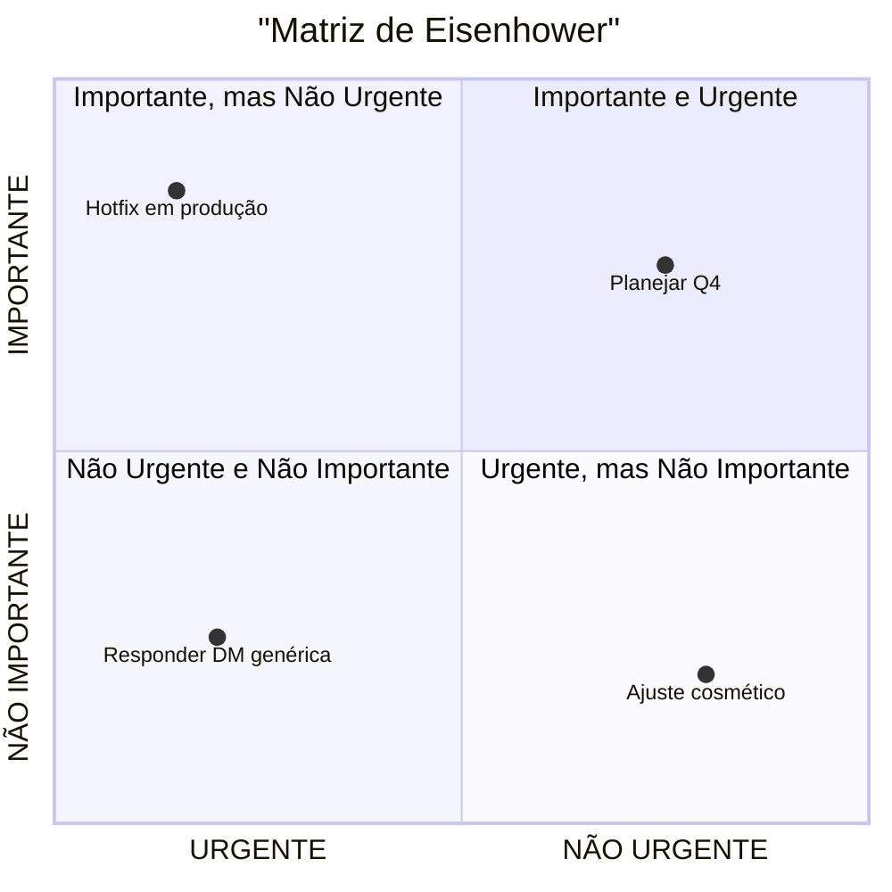

# Tasks 20/09/2025

ImpulsoCore

    - Tornar tipo "Whatsapp" como o canal padrão (ao dropdown ser habilitado ele já vem selecionado esse valor) 
    - Mostrar nome e telefone e não somente telefone no Dropdown de "Telefone de Canal/Inbox" (api get-agents-list)
    - Ao Exibir e Selecionar as Horas em "Agendamento/Horário (HH:mm)", precisamos exibir os horários de forma intuitiva/Usar ou criar componente moderno que vc seleciona as horas(como se fosse uma lista suspensa eu imagino) (hj o usuário digita o horario em yyyy mm dd, não é nada intuitivo)
    - Timezone tem que ser default America/Sao_Paulo, e não deve ser mostrado na UI 
    - Criar/ou utilizar um componente pronto de Calendário no "período de vigencia (data de início e fim)" para melhor experiencia de Uusário (calendário mostra por padrão selecionado o dia de hj, e o usuário seleciona nesse componente de UI os dias de inicio e fim(quando clica na data de inicio abre o calendário para ele selecionar, idem para a data de fim).

    - Não precisa selecionar a flag de  "Agendamento habilitado" pois o período de Vigencia já diz se está habilitado ou não (pode até usar o períod para ativar ou desativar esse flag, mas não mostre esse flag ao usuário(oculte da UI a checkbox de Agendamento habilitado ))
    - subir nivel/granulalidade do botao de Primeiro contato, oque eu quero dizer com isso é, hoje nós selecionamos pra cada contato se ele vai ser o primeiro contato ou não, oq eu quero é que essa seja geral ou não (invés de ser por contato, vamos flagar uma unica vez e ele deixara todos os contatos como primeiro contato ou não) (hj está por destinatario, vamos marcar ou todos os destinatarios ou nao) e Inverter a posição dos botoes (Primeiro Contato template com Adicionar contato, ai confere a granunalidade), o botão adicionar deve ficar no fim fora de cada contaot mas dentro do modal para ficar intuitivo que pode ser adicionado um novo contato manualmente.
    - Mover "Template de Primeiro contato e seu dropdown" para ficar entre Destinatários e o Form de Adicione manualmente ou importe via CSV para iniciar o envio/Nome Telefone Variáveis (form de destinatários), e esse "Template de Primeiro contato e seu dropdown"  só aparece quando flagamos Primeiro contato
    - Parar de usar a msg padrão(isso morre da UI) e usar msg de dias da semana (reestruture meu json de envio se precisar, pois acho que so uso o campo de mensagem padrao e nao mando a msg de cada dia da semana)
    - Criar flag de disparo diario (ele flega todos os dias uteis automaticamente)

Caos

