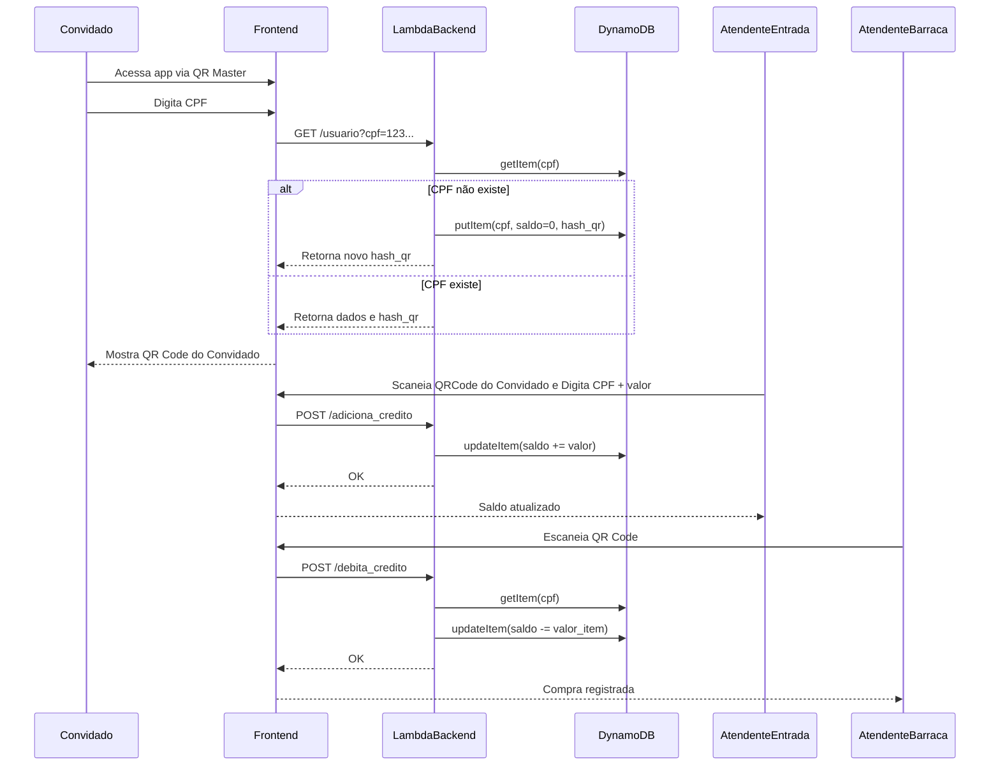
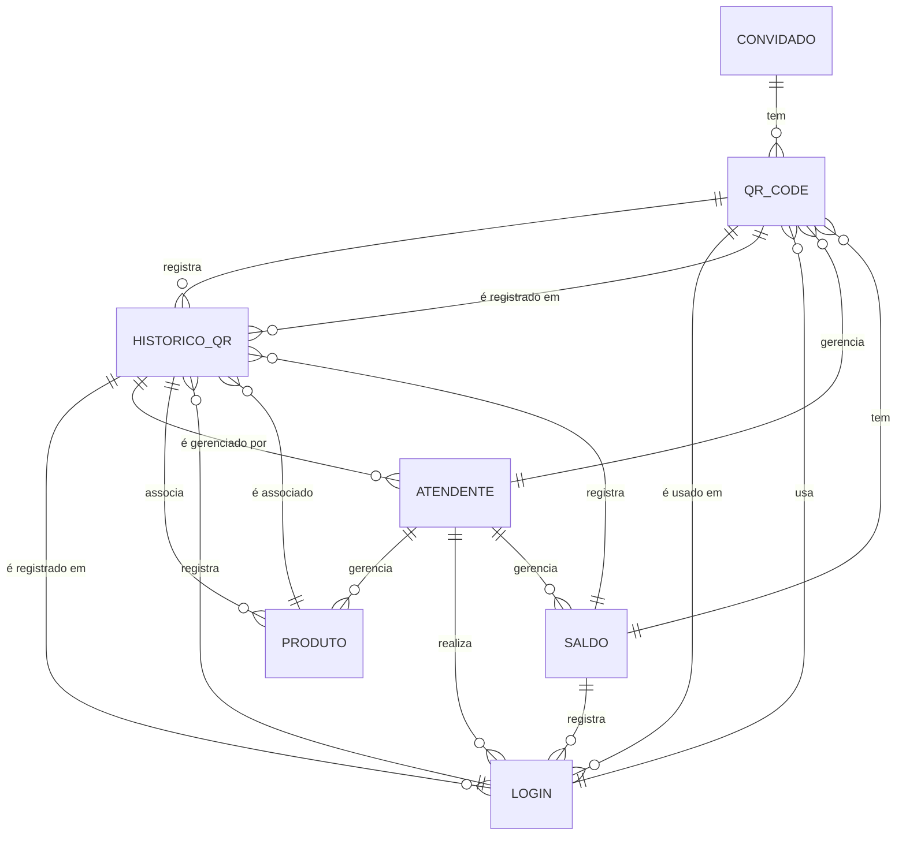

# 📄 Documentação do Sistema de Gestão de Créditos para Quermesse

---

## 🎯 **OBJETIVO GERAL**

Desenvolver um sistema de gestão de créditos para uma quermesse, utilizando tecnologias de código aberto e arquitetura serverless, permitindo que participantes (convidados) façam login via leitura de QR Code, consumam créditos em barracas e que atendentes realizem operações de carga e subtração de créditos. Tanto QrCode Fisico e QrCode Criado Virtualmente USANDO TELEFONE.

---

## 🎯 **OBJETIVO ESPECÍFICO**

- Permitir que o **convidado** entre no sistema via leitura de QR Code.

- Armazenar **saldo de crédito** no DynamoDB.

- Permitir que **atendentes** realizem operações de **carga de crédito** (com input de valor) e **subtração de crédito** (com input fixo, conforme o produto).

- Garantir **segurança** e **integridade** dos dados via **hash criptográfico**.

- Permitir que o sistema seja acessado via **QR Code Master** (banner de entrada).

---

## 📋 **REQUISITOS FUNCIONAIS**

| Requisito | Descrição |

|----------|-----------|

| RF1 | Login via leitura de QR Code (CPF) |

| RF2 | Verificação de CPF na Lambda |

| RF3 | Geração de QR Code para convidado (se CPF não existir) |

| RF4 | Tela de QR Code do Convidado |

| RF5 | Tela de Atendente (Barraca) com valor fixo |

| RF6 | Tela de Atendente (Entrada) com valor variável |

| RF7 | Subtração de crédito com validação do QR Code |

| RF8 | Adição de crédito com validação do QR Code |

| RF9 | Armazenamento de CPF e saldo no DynamoDB |

---

## 📋 **REQUISITOS NÃO FUNCIONAIS**

| Requisito | Descrição |

|----------|-----------|

| RN1 | Segurança: Autenticação via hash criptográfico |

| RN2 | Escalabilidade: Usar Lambda para escalar automaticamente |

| RN3 | Integração: Facilidade de integração com DynamoDB |

| RN4 | Usabilidade: Interface amigável para atendentes e convidados |

---

## 🧩 **Arquitetura do Sistema**

### 1. **Frontend (HTML + JS)**

- Interface para escaneamento de QR Code.

- Exibição de tela de convidado ou atendente.

- Envia dados para a Lambda via API REST.

### 2. **Lambda (Python / Node.js)**

- Recebe CPF do frontend.

- Consulta ou atualiza o DynamoDB.

- Gera QR Code com hash criptográfico.

- Retorna dados para o frontend.

### 3. **DynamoDB**

- Armazena CPF (chave primária) e saldo.

- Estrutura:

  ```json

  {

    "cpf": "12345678900",

    "saldo": 50.00

  }

  ```

---

## 🧩 **Fluxo de Funcionalidades**

### 🔁 Fluxo de Login com CPF Existente

1. Frontend escaneia QR Code e extrai CPF.

2. Frontend envia CPF para Lambda via `GET /get-user`.

3. Lambda consulta DynamoDB.

4. DynamoDB retorna CPF e saldo.

5. Lambda retorna dados para Frontend.

6. Frontend exibe tela de atendimento.

---

### 🔁 Fluxo de Login com CPF Inexistente

1. Frontend escaneia QR Code e extrai CPF.

2. Frontend envia CPF para Lambda via `GET /get-user`.

3. Lambda consulta DynamoDB.

4. DynamoDB não encontra CPF.

5. Lambda gera QR Code com hash.

6. Lambda cria registro no DynamoDB com CPF e saldo inicial.

7. Lambda retorna CPF, saldo e QR Code para Frontend.

8. Frontend exibe tela de convidado com QR Code.

---

### 🔁 Fluxo de Carga de Crédito

1. Atendente escaneia QR Code e extrai CPF.

2. Frontend envia CPF para Lambda via `GET /get-user`.

3. Lambda consulta DynamoDB.

4. Atendente insere valor a ser carregado.

5. Frontend envia CPF e valor para Lambda via `POST /update-saldo`.

6. Lambda atualiza saldo no DynamoDB.

7. Lambda retorna sucesso para Frontend.

8. Frontend exibe mensagem de sucesso.

---

### 🔁 Fluxo de Subtração de Crédito

1. Atendente escaneia QR Code e extrai CPF.

2. Frontend envia CPF para Lambda via `GET /get-user`.

3. Lambda consulta DynamoDB.

4. Atendente seleciona produto (ex: R$2,00).

5. Frontend envia CPF e valor para Lambda via `POST /update-saldo`.

6. Lambda atualiza saldo no DynamoDB.

7. Lambda retorna sucesso para Frontend.

8. Frontend exibe mensagem de sucesso.

---

## 🧩 **Exemplo de Código de Lambda (Python)**

```python
import boto3
import json
import hashlib

dynamodb = boto3.resource('dynamodb')
table = dynamodb.Table('convidados')

def lambda_handler(event, context):
    cpf = event['queryStringParameters']['cpf']
    # Verifica se CPF existe no DynamoDB
    response = table.get_item(Key={'cpf': cpf})

    if 'Item' in response:
        # CPF existe
        return {
            'statusCode': 200,
            'body': json.dumps({
                'cpf': cpf,
                'saldo': response['Item']['saldo']
            })
        }

    else:
        # CPF não existe: gera QR Code e cria novo registro
        hash_obj = hashlib.sha256(cpf.encode())
        hash_hex = hash_obj.hexdigest()
        table.put_item(Item={'cpf': cpf, 'saldo': 0.00})
        return {
            'statusCode': 200,
            'body': json.dumps({
                'cpf': cpf,
                'saldo': 0.00,
                'qr_code': hash_hex
            })
        }
```

---

## 🧩 **Benefícios de Usar Lambda como Backend**

| Benefício | Descrição |

|----------|-----------|

| **Escalabilidade** | A Lambda escala automaticamente com a demanda. |

| **Sem servidores** | Você não precisa gerenciar servidores. |

| **Custo eficiente** | Paga apenas pelo tempo de execução. |

| **Integração fácil com DynamoDB** | AWS Lambda e DynamoDB são nativos da AWS. |

| **Segurança** | Pode usar autenticação e validação com hash criptográfico. |

---

## 🧩 **Resumo**

✅ A **Lambda** atua como o **backend** do seu sistema, sendo o **intermediário entre o frontend HTML e o DynamoDB**.

✅ Ela:

- Recebe dados do frontend

- Consulta ou atualiza o DynamoDB

- Retorna dados para o frontend

- Gera QR Code com hash para segurança




* Encrypt CPF


CARGOS

Convidados

Atendentes

- Entrada (input valor variavel == credita + Opção Extornar valor = Subtraia a 0/Iguala a 0 no Banco)

- Barracas (input fixo == debita)


MOSTRAR O SALDO AO RECUPERAR O QRCODE


LOGIN 

Se TelCel não está na Tb_Atendentes

    Se TelCel existe

        Recuperar QrCode (MOSTRAR O SALDO AO RECUPERAR O QRCODE)

    Se nao existe

        Cria QrCode

        Resgatar QrCode

Caso Contrário

    Scan QrCode


Tb_QrCode

- GUUID (PK)

- TelCel

- SaldoAtual

- Dt. Cpu
  
  

123  94162-8817


Tb_Atendentes

- GUUID (PK)

- TelCel

- Cargo

- Produto (VALIDAR SE VAMOS POR A TABELA DE PRODUTOS NO FRONT OU BACK)
  
  

Tb_QrCode_Historico

- GUUID (PK)

- TelCel

- SaldoAtual

- ValorProduto

- Produto

- DtCpu





