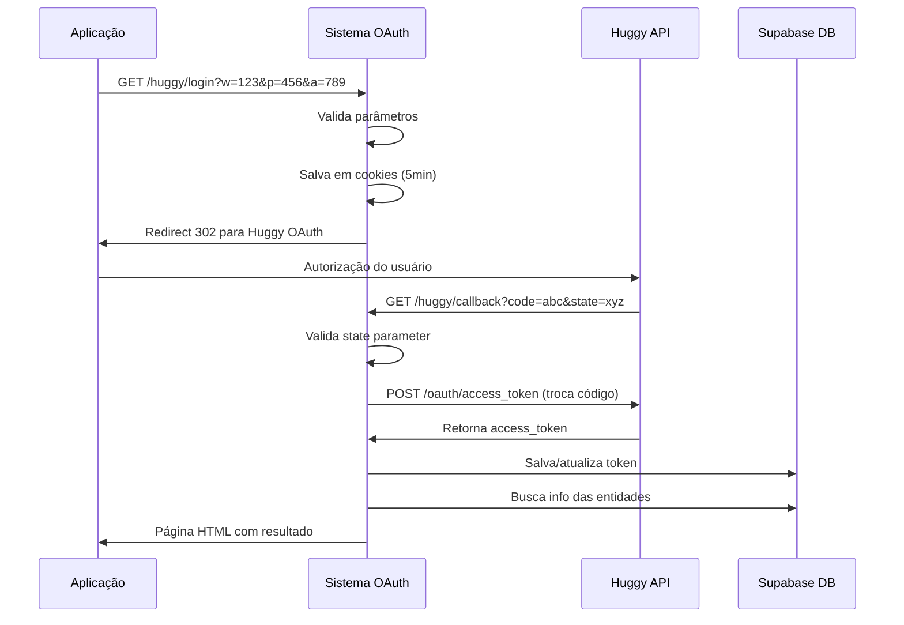

# 🔐 Tonico OAuth - Sistema de Integração Huggy

> **Sistema serverless para integração OAuth com a plataforma Huggy, permitindo autenticação segura e gerenciamento de tokens de acesso para workspaces, profiles e agentes.**

## 📋 O que é este projeto?

Este é um **sistema de autenticação OAuth** desenvolvido em TypeScript que facilita a integração entre aplicações e a **API da Huggy** (plataforma de atendimento ao cliente). O sistema gerencia todo o fluxo de autenticação OAuth 2.0, desde a autorização inicial até o armazenamento seguro dos tokens de acesso.

### 🎯 Objetivo Principal

Automatizar e simplificar o processo de autenticação com a Huggy API, permitindo que aplicações obtenham e gerenciem tokens de acesso de forma segura, sem que os desenvolvedores precisem implementar manualmente todo o fluxo OAuth.

### 🔄 Como Funciona

1. **Iniciação**: Aplicação redireciona usuário para `/huggy/login` com parâmetros de identificação

2. **Autorização**: Sistema redireciona para OAuth da Huggy onde usuário autoriza acesso

3. **Callback**: Huggy retorna código de autorização via callback

4. **Troca de Token**: Sistema troca código por token de acesso permanente

5. **Armazenamento**: Token é salvo no banco de dados associado ao workspace/profile/agente

6. **Confirmação**: Usuário recebe página HTML com confirmação e detalhes da operação

### 🏢 Casos de Uso

- **Integrações SaaS**: Conectar sistemas internos com Huggy

- **Automações**: Criar bots e automações que interagem com Huggy

- **Dashboards**: Desenvolver painéis personalizados com dados da Huggy

- **Sincronização**: Sincronizar dados entre Huggy e outros sistemas

## 🏗️ Arquitetura do Sistema

### Visão Geral

Sistema baseado em **arquitetura serverless** usando AWS Lambda, com design modular que separa responsabilidades em camadas bem definidas.

### Estrutura de Pastas

```
src/

├── core/                          # 🏛️ Núcleo do sistema

│   ├── config/

│   │   └── supabaseConect.ts      # 🔌 Conexão com banco Supabase

│   ├── contracts/

│   │   └── types.ts               # 📝 Contratos e tipos TypeScript

│   └── utils/                     # 🛠️ Utilitários compartilhados

│       ├── parseCookies.ts        # 🍪 Parser de cookies HTTP

│       └── sendResponses/         # 📤 Utilitários de resposta

│           ├── sendResponse.ts    # JSON responses

│           ├── sendHtmlResponse.ts # HTML responses

│           └── sendRedirect.ts    # HTTP redirects

├── modules/

│   └── huggy/                     # 🤖 Módulo de integração Huggy

│       ├── handlers/              # 🎯 Endpoints da API

│       │   ├── login.ts           # Iniciar fluxo OAuth

│       │   ├── callback.ts        # Processar retorno OAuth

│       │   └── favicon.ts         # Servir favicon

│       └── services/              # ⚙️ Lógica de negócio

│           ├── exchangeCodeForAccessToken.ts  # Trocar código por token

│           ├── getHuggyLoginUrl.ts            # Gerar URL de login

│           ├── saveHuggyAuth.ts               # Salvar tokens no DB

│           └── getEntityInfo.ts               # Buscar info das entidades

└── types/

    └── env.d.ts                   # 🌍 Tipagem de variáveis ambiente
```

### Camadas da Aplicação

#### 🎯 **Handlers (Camada de Apresentação)**

- Recebem requisições HTTP

- Validam parâmetros de entrada

- Orquestram chamadas aos serviços

- Formatam respostas (JSON/HTML/Redirect)

#### ⚙️ **Services (Camada de Negócio)**

- Implementam regras de negócio

- Fazem integrações externas (Huggy API)

- Gerenciam persistência de dados

- Processam lógica de autenticação

#### 🏛️ **Core (Camada de Infraestrutura)**

- Configurações de banco de dados

- Utilitários compartilhados

- Contratos e tipos

- Helpers de resposta HTTP

## 🚀 Funcionalidades Principais

### 🔐 Sistema de Autenticação OAuth 2.0

Implementação completa do fluxo OAuth com a Huggy API, incluindo:

- Geração de URLs de autorização

- Validação de state parameters

- Troca segura de códigos por tokens

- Renovação automática de tokens

### 💾 Gerenciamento Inteligente de Tokens

- **Armazenamento seguro** no Supabase PostgreSQL

- **Detecção automática** de tokens existentes

- **Atualização inteligente** (update vs insert)

- **Associação por entidade** (workspace + profile + agent)

### 🌐 API RESTful Completa

#### **GET** `/huggy/login`

**Inicia o fluxo de autenticação OAuth**

```
/huggy/login?w={workspace_id}&p={profile_id}&a={agent_id}
```

- Valida parâmetros obrigatórios

- Salva contexto em cookies seguros (5min TTL)

- Redireciona para autorização Huggy

#### **GET** `/huggy/callback`

**Processa retorno da autorização**

```
/huggy/callback?code={auth_code}&state={encoded_state}
```

- Valida state parameter

- Troca código por token de acesso

- Salva/atualiza token no banco

- Retorna página HTML com resultado

#### **GET** `/favicon.ico`

**Serve favicon personalizado**

- Retorna SVG otimizado

- Headers de cache apropriados

### 🎨 Interface de Usuário Rica

- **Página HTML responsiva** com resultado da operação

- **Design moderno** com gradientes e cards

- **Informações detalhadas** de todas as entidades

- **Status visual** (sucesso/erro) com cores diferenciadas

- **Timestamp brasileiro** da operação

### 🔄 Fluxo Detalhado de Funcionamento



### 🛡️ Recursos de Segurança

- **Cookies HTTPOnly** com expiração automática

- **Validação de state** para prevenir CSRF

- **Headers de segurança** apropriados

- **Tratamento robusto** de erros

- **Logs detalhados** para auditoria

## 💡 Diferenciais Técnicos

### 🎨 **Interface Rica e Informativa**

- Página HTML responsiva com design profissional

- Informações completas: workspace, profile, agente e token

- Status visual claro (✅ sucesso / ❌ erro)

- Timestamp em formato brasileiro

### 🍪 **Gestão Inteligente de Estado**

- Cookies seguros com expiração automática (5 minutos)

- Persistência de contexto entre requisições

- Fallback para query parameters

### 🔄 **Operações Idempotentes**

- Detecção automática de tokens existentes

- Update inteligente vs insert novo

- Prevenção de duplicatas no banco

### 📊 **Observabilidade Completa**

- Logs estruturados para debugging

- Request IDs para rastreamento

- Métricas de tempo de execução

- Tratamento gracioso de erros

## 🛠️ Stack Tecnológico

### **Backend & Runtime**

- **TypeScript 5.8+**: Tipagem estática, melhor DX e manutenibilidade

- **Node.js 22**: Runtime moderno com performance otimizada

- **AWS Lambda**: Execução serverless com auto-scaling

- **Serverless Framework**: Deploy e gerenciamento de infraestrutura

### **Banco de Dados**

- **Supabase**: PostgreSQL gerenciado com APIs REST automáticas

- **@supabase/supabase-js**: Cliente oficial com tipagem TypeScript

### **Integrações Externas**

- **Huggy OAuth API**: Autenticação com plataforma de atendimento

- **Fetch API**: Requisições HTTP nativas do Node.js

### **Desenvolvimento & Build**

- **ESBuild**: Bundling ultra-rápido

- **Nodemon**: Hot reload para desenvolvimento

- **Serverless Offline**: Emulação local de Lambda

### **Qualidade de Código**

- **Zod**: Validação de schemas em runtime

- **TypeScript Strict Mode**: Máxima segurança de tipos

- **Modular Architecture**: Separação clara de responsabilidades

## 🚀 Guia de Instalação e Configuração

### 📦 **1. Instalação das Dependências**

```bash
# Clone o repositório

git clone <repository-url>

cd oauth-tonico


# Instale as dependências

npm install


# Verifique a versão do Node.js (requer 22+)

node --version
```

### 🔧 **2. Configuração do Ambiente**

#### **2.1 Crie o arquivo `.env`**

```bash
cp .env.example .env
```

#### **2.2 Configure as variáveis obrigatórias**

```env
# 🌍 Ambiente

NODE_ENV=development

LOG_LEVEL=debug


# 🗄️ Supabase (Banco de Dados)

SUPABASE_URL=https://your-project.supabase.co

SUPABASE_KEY=your-anon-public-key


# 🤖 Huggy OAuth (obtenha no painel da Huggy)

HUGGY_CLIENT_ID=your_huggy_client_id

HUGGY_CLIENT_SECRET=your_huggy_client_secret

HUGGY_REDIRECT_URI=http://localhost:3001/huggy/callback

HUGGY_REDIRECT_URI_END=https://your-final-redirect.com
```

#### **2.3 Configure o banco Supabase**

```sql
-- Crie a tabela para armazenar tokens

CREATE TABLE huggy_tokens (

  id UUID DEFAULT gen_random_uuid() PRIMARY KEY,

  workspace_id VARCHAR NOT NULL,

  profile_id VARCHAR NOT NULL,

  agent_id VARCHAR NOT NULL,

  access_token TEXT NOT NULL,

  token_type VARCHAR DEFAULT 'Bearer',

  expires_in VARCHAR,

  refresh_token TEXT,

  status VARCHAR DEFAULT 'active',

  created_at TIMESTAMP DEFAULT NOW(),

  updated_at TIMESTAMP DEFAULT NOW(),

  UNIQUE(workspace_id, profile_id, agent_id)

);


-- Tabelas opcionais para informações das entidades

CREATE TABLE workspace (id UUID PRIMARY KEY, name VARCHAR);

CREATE TABLE profile (id UUID PRIMARY KEY, email VARCHAR);

CREATE TABLE agent (id UUID PRIMARY KEY, name VARCHAR);
```

### 🏃‍♂️ **3. Executando o Projeto**

#### **Desenvolvimento Local**

```bash
# Inicia servidor local com hot reload

npm run dev


# Ou inicie diretamente

npm start
```

#### **Build para Produção**

```bash
# Compila TypeScript

npm run build


# Valida configuração serverless

npm run validate
```

#### **Deploy**

```bash
# Deploy para desenvolvimento

npm run deploy:dev


# Deploy para produção

npm run deploy:prod


# Visualizar informações do deploy

npm run info
```

### 🧪 **4. Testando a Integração**

#### **Teste Local**

```bash
# Acesse no navegador:

http://localhost:3001/huggy/login?w=workspace-uuid&p=profile-uuid&a=agent-uuid


# Ou teste o favicon:

http://localhost:3001/favicon.ico
```

#### **Teste de Logs**

```bash
# Visualizar logs em tempo real

npm run logs:login

npm run logs:callback

npm run logs:favicon
```

## 📝 Referência de Tipos TypeScript

### 🎯 **Eventos e Requisições**

```typescript
// Evento customizado para handlers Huggy

interface HuggyEvent extends APIGatewayProxyEvent {

  workspace_id?: string;

  profile_id?: string;

  agent_id?: string;

  cookies?: string[];

}


// Parâmetros de query esperados

interface QueryParameters {

  w?: string;        // workspace_id

  p?: string;        // profile_id  

  a?: string;        // agent_id

  code?: string;     // OAuth authorization code

  state?: string;    // OAuth state parameter

}


// Cookies parseados

interface Cookies {

  workspace_id?: string;

  profile_id?: string;

  agent_id?: string;

  [key: string]: string | undefined;

}
```

### 🔐 **OAuth e Autenticação**

```typescript
// Dados do token de acesso da Huggy

interface HuggyAccessTokenData {

  access_token: string;   // Token de acesso

  token_type: string;     // Tipo (geralmente "Bearer")

  expires_in: string;     // Tempo de expiração

  refresh_token: string;  // Token para renovação

}


// Estado codificado para OAuth

interface HuggyStateData {

  workspaceId: string;

}


// Resultado da operação de salvamento

interface HuggyAuthResult {

  auth: string;     // Mensagem de status

  tokenId: string;  // UUID do token salvo

}
```

### 📊 **Informações das Entidades**

```typescript
// Informações adicionais das entidades

interface EntityInfo {

  workspaceName?: string;  // Nome do workspace

  profileEmail?: string;   // Email do profile

  agentName?: string;      // Nome do agente

}
```

### 📤 **Respostas da API**

```typescript
// Estrutura padrão de resposta JSON

interface ResponseBody {

  success: boolean;

  message: string;

  requestId: string;

  executionTime: number;

  data?: any;

  error?: any;

}


// Resposta com suporte a cookies

interface APIGatewayProxyResultWithCookies extends APIGatewayProxyResult {

  cookies?: string[];

}
```

### ⚙️ **Funções de Serviço**

```typescript
// Assinatura das principais funções de serviço

type ExchangeCodeFunction = (code: string) => Promise<HuggyAccessTokenData>;


type GetLoginUrlFunction = (workspaceId: string) => string;


type SaveAuthFunction = (

  workspaceId: string,

  profileId: string,

  agentId: string,

  accessTokenData: HuggyAccessTokenData

) => Promise<HuggyAuthResult>;


type HandlerFunction = (

  event: HuggyEvent,

  workspace_id: string,

  profile_id: string,

  agent_id: string

) => Promise<APIGatewayProxyResult>;
```

## 🔄 Fluxo Detalhado de Dados

### **1. Requisição Inicial**

```
GET /huggy/login?w=workspace&p=profile&a=agent

↓

APIGatewayProxyEvent → HuggyEvent
```

### **2. Validação e Preparação**

```
Extração de parâmetros (query + cookies)

↓

Validação de campos obrigatórios

↓

Geração de URL OAuth com state
```

### **3. Autorização OAuth**

```
Redirect 302 para Huggy

↓

Usuário autoriza aplicação

↓

Huggy redireciona para /callback
```

### **4. Processamento do Callback**

```
Validação do state parameter

↓

Troca código por access_token

↓

Verificação de token existente no DB
```

### **5. Persistência Inteligente**

```
Token existe? → UPDATE

Token novo? → INSERT

↓

Retorna UUID do token
```

### **6. Enriquecimento de Dados**

```
Busca informações do workspace

↓

Busca informações do profile  

↓

Busca informações do agente
```

### **7. Resposta Final**

```
Geração de página HTML

↓

Inclusão de todas as informações

↓

APIGatewayProxyResult (HTML)
```

## 🧪 Testes e Qualidade

### **Executar Testes**

```bash
# Executar todos os testes

npm test


# Executar em modo watch

npm run test:watch


# Linting do código

npm run lint


# Corrigir problemas de lint

npm run lint:fix
```

### **Validação de Configuração**

```bash
# Validar serverless.yml

npm run validate


# Verificar informações do projeto

npm run info
```

## 📚 Documentação Completa da API

### 🚀 **GET** `/huggy/login`

**Descrição**: Inicia o fluxo de autenticação OAuth com a Huggy API

#### **Parâmetros de Query**

| Parâmetro | Tipo | Obrigatório | Descrição |

|-----------|------|-------------|-----------|

| `w` | string | ✅ | UUID do workspace |

| `p` | string | ✅ | UUID do profile |

| `a` | string | ✅ | UUID do agente |

#### **Exemplo de Requisição**

```http
GET /huggy/login?w=550e8400-e29b-41d4-a716-446655440000&p=6ba7b810-9dad-11d1-80b4-00c04fd430c8&a=6ba7b811-9dad-11d1-80b4-00c04fd430c8
```

#### **Respostas**

**✅ Sucesso (302 Found)**

```http
HTTP/1.1 302 Found

Location: https://auth.huggy.app/oauth/authorize?client_id=...

Set-Cookie: workspace_id=550e8400...; HttpOnly; SameSite=Lax

Set-Cookie: profile_id=6ba7b810...; HttpOnly; SameSite=Lax  

Set-Cookie: agent_id=6ba7b811...; HttpOnly; SameSite=Lax
```

**❌ Erro (403 Forbidden)**

```json
{

  "success": false,

  "message": "workspace_id missing.",

  "requestId": "abc123",

  "executionTime": 45,

  "error": "workspace_id missing."

}
```

---

### 🔄 **GET** `/huggy/callback`

**Descrição**: Processa o retorno da autorização OAuth da Huggy

#### **Parâmetros de Query**

| Parâmetro | Tipo | Obrigatório | Descrição |

|-----------|------|-------------|-----------|

| `code` | string | ✅ | Código de autorização da Huggy |

| `state` | string | ✅ | Estado codificado em base64 |

#### **Exemplo de Requisição**

```http
GET /huggy/callback?code=abc123def456&state=eyJ3b3Jrc3BhY2VJZCI6IjU1MGU4NDAwLWUyOWItNDFkNC1hNzE2LTQ0NjY1NTQ0MDAwMCJ9
```

#### **Resposta**

**✅ Sucesso (200 OK)**

```html
<!DOCTYPE html>

<html>

<head>

    <title>Resultado OAuth - Sucesso</title>

    <!-- CSS inline com design responsivo -->

</head>

<body>

    <div class="container">

        <div class="status success">✅ Sucesso</div>

        <div class="message">Novo registro salvo</div>

        <!-- Cards com informações das entidades -->

        <div class="info-grid">

            <div class="info-item">

                <div class="info-label">Workspace</div>

                <div class="info-value">Minha Empresa LTDA</div>

                <div class="uuid">UUID: 550e8400-e29b-41d4-a716-446655440000</div>

            </div>

            <!-- Mais cards... -->

        </div>

        <div class="timestamp">

            Processado em: 03/07/2025 14:30:25

        </div>

    </div>

</body>

</html>
```

---

### 🎨 **GET** `/favicon.ico`

**Descrição**: Retorna o favicon personalizado da aplicação

#### **Resposta**

**✅ Sucesso (200 OK)**

```http
HTTP/1.1 200 OK

Content-Type: image/svg+xml

Cache-Control: public, max-age=3000000

Access-Control-Allow-Origin: *


<svg width="32" height="32" viewBox="0 0 32 32" fill="none" xmlns="http://www.w3.org/2000/svg">

  <!-- SVG content -->

</svg>
```

---

### 📊 **Códigos de Status**

| Código | Significado | Quando Ocorre |

|--------|-------------|---------------|

| `200` | OK | Operação realizada com sucesso |

| `302` | Found | Redirecionamento para OAuth |

| `403` | Forbidden | Parâmetros obrigatórios ausentes |

| `500` | Internal Server Error | Erro interno do sistema |

### 🔍 **Headers Importantes**

#### **Segurança**

- `Access-Control-Allow-Origin: *`

- `Access-Control-Allow-Credentials: true`

- `Content-Type: application/json` ou `text/html`

#### **Cookies**

- `HttpOnly`: Previne acesso via JavaScript

- `SameSite=Lax`: Proteção CSRF

- `Expires`: Expiração automática em 5 minutos

## 🎨 Interface de Usuário

### **Página de Resultado OAuth**

A página HTML retornada após o callback inclui:

#### **🎨 Design Moderno**

- Layout responsivo que funciona em desktop e mobile

- Gradiente de fundo azul (#3b62ff)

- Cards com sombras e bordas arredondadas

- Tipografia Archivo (fonte profissional)

#### **📊 Informações Completas**

- **Status visual**: ✅ Sucesso ou ❌ Fracasso

- **Workspace**: Nome + UUID

- **Profile**: Email + UUID  

- **Agente**: Nome + UUID

- **Token**: UUID do token salvo

- **Timestamp**: Data/hora em português brasileiro

#### **🎯 Elementos Visuais**

- Logo SVG da aplicação (250px)

- Cores diferenciadas por status (verde/vermelho)

- Grid responsivo de informações

- Fonte monospace para UUIDs

- Timestamp centralizado

### **Exemplo Visual**

```
┌─────────────────────────────────────────┐

│              [LOGO SVG]                 │

│                                         │

│            ✅ Sucesso                   │

│         Novo registro salvo             │

│                                         │

│  ┌─────────────────────────────────────┐ │

│  │ Workspace                           │ │

│  │ Minha Empresa LTDA                  │ │

│  │ UUID: 550e8400-e29b-41d4-a716...    │ │

│  └─────────────────────────────────────┘ │

│                                         │

│  ┌─────────────────────────────────────┐ │

│  │ Profile                             │ │

│  │ admin@empresa.com                   │ │

│  │ UUID: 6ba7b810-9dad-11d1-80b4...    │ │

│  └─────────────────────────────────────┘ │

│                                         │

│  ┌─────────────────────────────────────┐ │

│  │ Agente                              │ │

│  │ João Silva                          │ │

│  │ UUID: 6ba7b811-9dad-11d1-80b4...    │ │

│  └─────────────────────────────────────┘ │

│                                         │

│  ┌─────────────────────────────────────┐ │

│  │ Token Huggy                         │ │

│  │ UUID do seu token Huggy             │ │

│  │ UUID: 7ca8c912-aead-22e2-91c5...    │ │

│  └─────────────────────────────────────┘ │

│                                         │

│     Processado em: 03/07/2025 14:30:25 │

└─────────────────────────────────────────┘
```

## 🔒 Segurança e Conformidade

### **🛡️ Medidas de Segurança Implementadas**

#### **Cookies Seguros**

- **HttpOnly**: Previne acesso via JavaScript malicioso

- **SameSite=Lax**: Proteção contra ataques CSRF

- **Expiração automática**: 5 minutos para minimizar janela de exposição

- **Path específico**: Limitado ao escopo da aplicação

#### **Validação OAuth**

- **State parameter**: Validação obrigatória para prevenir CSRF

- **Codificação base64**: State codificado com informações do workspace

- **Verificação de origem**: Comparação do workspaceId no state

#### **Headers de Segurança**

```http
Access-Control-Allow-Origin: *

Access-Control-Allow-Credentials: true

Access-Control-Allow-Headers: Content-Type, Authorization

Access-Control-Allow-Methods: GET, POST, OPTIONS
```

#### **Tratamento de Erros**

- **Logs estruturados**: Informações detalhadas para auditoria

- **Sanitização**: Dados sensíveis não expostos em logs

- **Graceful degradation**: Falhas não quebram o fluxo

- **Request tracking**: UUID único por requisição

### **🔐 Boas Práticas de Segurança**

#### **Armazenamento de Tokens**

- Tokens salvos em banco seguro (Supabase)

- Criptografia em trânsito (HTTPS obrigatório)

- Associação por entidade (workspace + profile + agent)

- Detecção de duplicatas

#### **Validação de Entrada**

- Parâmetros obrigatórios validados

- Tipos verificados em runtime

- Sanitização de dados de entrada

- Prevenção de injection attacks

#### **Monitoramento**

- Logs de todas as operações

- Métricas de tempo de execução  

- Request IDs para rastreamento

- Alertas em caso de falhas

## 🚀 Deploy e Produção

### **☁️ Deploy na AWS**

#### **Ambientes Disponíveis**

```bash
# Desenvolvimento

npm run deploy:dev


# Produção  

npm run deploy:prod


# Remover stack

npm run remove:dev

npm run remove:prod
```

#### **Configuração de Produção**

```yaml
# serverless.yml

provider:

  name: aws

  runtime: nodejs22.x

  region: us-east-1

  memorySize: 512

  timeout: 30

  # Variáveis de ambiente

  environment:

    NODE_ENV: ${env:NODE_ENV}

    HUGGY_CLIENT_ID: ${env:HUGGY_CLIENT_ID}

    # ... outras variáveis
```

### **📊 Monitoramento**

#### **Logs em Tempo Real**

```bash
# Logs específicos por função

npm run logs:login

npm run logs:callback  

npm run logs:favicon


# Ou via AWS CLI

aws logs tail /aws/lambda/oauth-tonico-dev-huggy-login --follow
```

#### **Métricas Importantes**

- **Tempo de execução**: < 30 segundos

- **Uso de memória**: < 512MB

- **Taxa de erro**: < 1%

- **Latência**: < 2 segundos

### **🔧 Troubleshooting**

#### **Problemas Comuns**

**❌ "workspace_id missing"**

```bash
# Verifique se os parâmetros estão corretos

curl "https://api.exemplo.com/huggy/login?w=uuid&p=uuid&a=uuid"
```

**❌ "HUGGY_CLIENT_ID environment variable is required"**

```bash
# Verifique as variáveis de ambiente

serverless print | grep HUGGY_CLIENT_ID
```

**❌ "Erro na API da Huggy: 401"**

```bash
# Verifique as credenciais OAuth no painel da Huggy

# CLIENT_ID e CLIENT_SECRET devem estar corretos
```

#### **Debug Local**

```bash
# Executar com logs detalhados

LOG_LEVEL=debug npm run dev


# Verificar configuração

npm run validate
```

## 🤝 Contribuição

### **📋 Como Contribuir**

1. **Fork** o repositório

2. **Crie** uma branch para sua feature (`git checkout -b feature/nova-funcionalidade`)

3. **Commit** suas mudanças (`git commit -am 'Adiciona nova funcionalidade'`)

4. **Push** para a branch (`git push origin feature/nova-funcionalidade`)

5. **Abra** um Pull Request

### **📝 Padrões de Código**

- **TypeScript strict mode** habilitado

- **ESLint** para linting

- **Prettier** para formatação

- **Conventional Commits** para mensagens

### **🧪 Antes de Contribuir**

```bash
# Execute os testes

npm test


# Verifique o linting

npm run lint


# Valide a configuração

npm run validate
```

## 📞 Suporte

### **🆘 Precisa de Ajuda?**

- **📧 Email**: [seu-email@exemplo.com]

- **💬 Issues**: [GitHub Issues](link-para-issues)

- **📖 Wiki**: [Documentação Completa](link-para-wiki)

### **🐛 Reportar Bugs**

Ao reportar bugs, inclua:

- Versão do Node.js

- Logs de erro completos

- Passos para reproduzir

- Configuração de ambiente

---

## 📄 Licença

Este projeto está licenciado sob a **ISC License** - veja o arquivo [LICENSE](LICENSE) para detalhes.

---

**Desenvolvido com ❤️ usando TypeScript e Serverless Framework**
