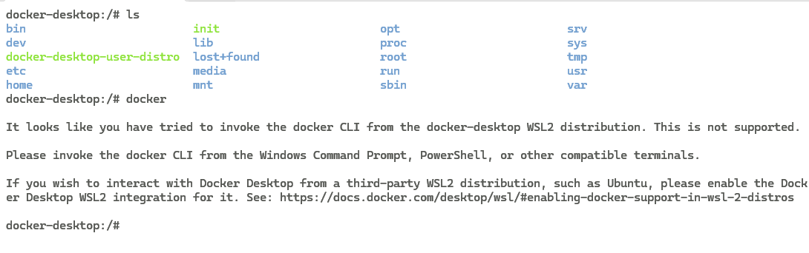
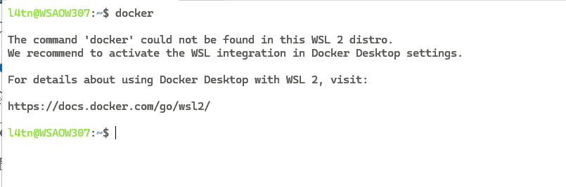
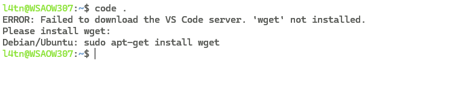

flowchart LR

  W["Windows 11 (host)"]
  DD["Docker Desktop (app do Windows)"]

  subgraph WSL["WSL2 (kernel Linux)"]
    DEB["Debian (sua distro WSL)"]
    CLI["Docker CLI (no Debian)"]

    subgraph DINT["Docker no WSL2 (interno)"]
      DDESK["docker-desktop (distro interna)"]
      ENG["Docker Engine / dockerd"]
    end

    subgraph CT["Containers Linux"]
      CW["Chatwoot"]
      PG["Postgres"]
      RD["Redis"]
    end
  end

  W -->|"Roda"| DD
  W -->|"Hospeda"| WSL

  DEB -->|"Você trabalha aqui"| CLI
  CLI -->|"Chama API do Docker (WSL integration)"| ENG

  DD -->|"Gerencia"| DDESK
  DDESK --> ENG

  ENG -->|"Roda"| CW
  ENG -->|"Roda"| PG
  ENG -->|"Roda"| RD

  Esse fluxograma em MermaidJS mostra como podemos desenvolver no Chatwoot/ImpulsoHub de forma mais organizada e segura usando Linux
  Criei esse arquivo com a intenção de utilizar mais Linux para o desenvolvimento, e o motivo foi o Chatwoot, que é uma Excelente aplicação, mas bem Linux First(para rodar no W11 é muito compliado, até o encode de Linhas é diferente alem de caminhos de arquivos diferentes)

Obs: Integration WSL nao consegue chamar o docker no CLI, oq consegue é o Debian que roda em cima do WSL

Obs2: Integration de abrir container com o Vscode que está no windows é mt útil
