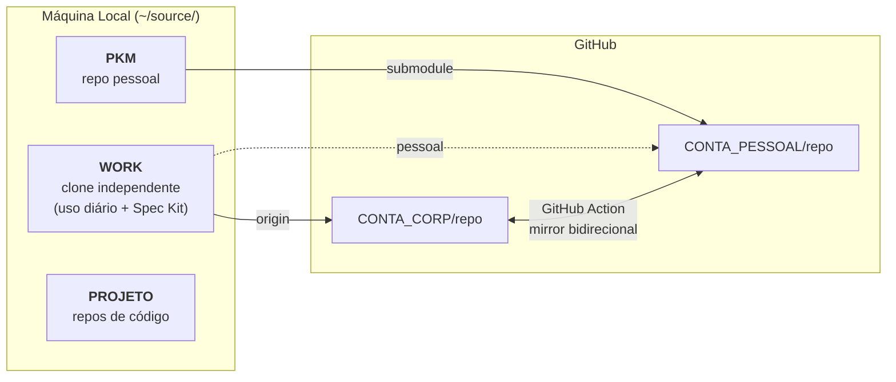
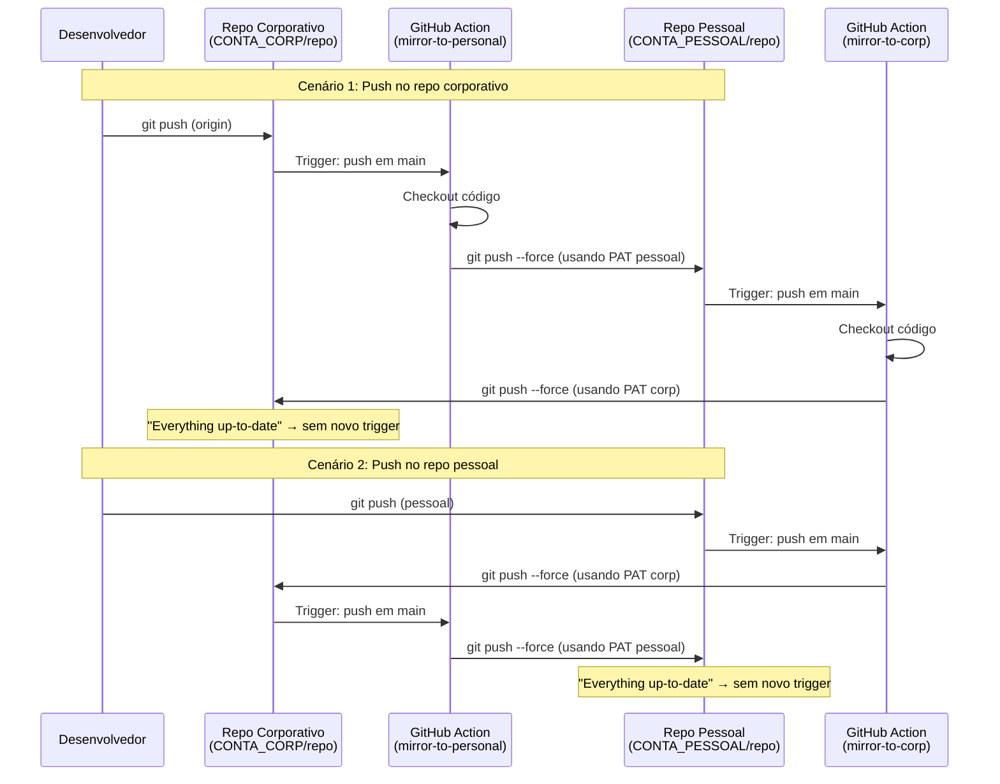
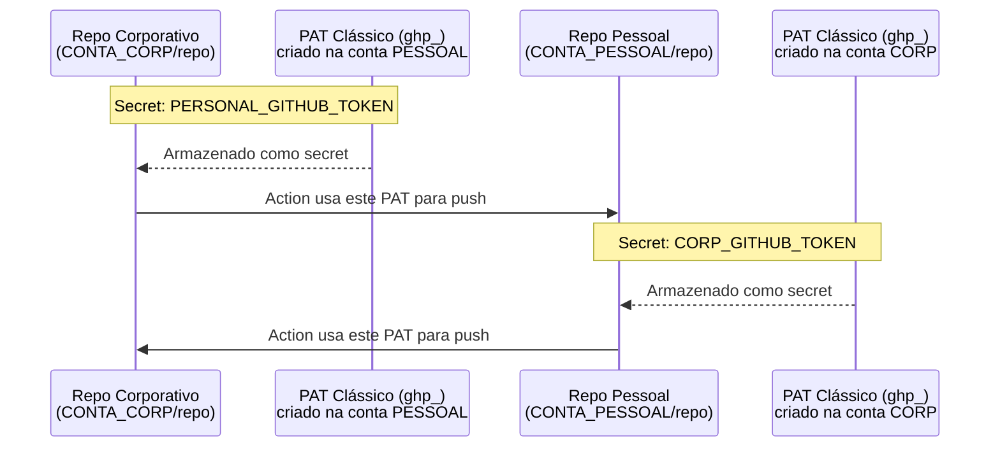
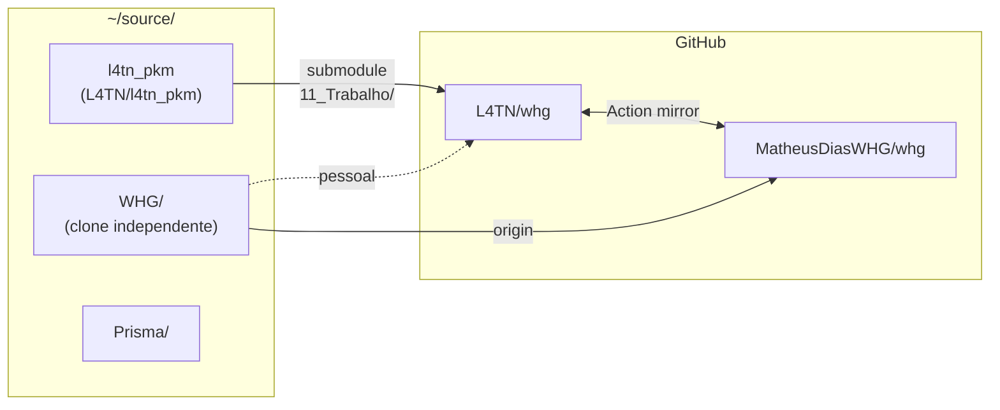

# Separando PKM Pessoal e Trabalho Corporativo com Dual Repo + Mirror Bidirecional

**Criado:** 2026-03-01 | **Autor:** Matheus Dias (L4TN) | **Status:** Validado

---

## O que é este pattern

Um pattern para **separar vida pessoal e trabalho no GitHub** sem perder a conexão entre eles.

### O problema

O PKM pessoal (organização de vida, projetos pessoais, anotações) continha uma **pasta de trabalho** com specs, tasks e notas corporativas. Misturar os dois mundos num único repo pessoal gera atrito: o trabalho fica preso na conta pessoal, e não pode ser usado diretamente como fonte para ferramentas corporativas como o **GitHub Spec Kit**.

### A solução

Extrair a pasta de trabalho para um **repo próprio**, mantendo um mirror bidirecional entre conta pessoal e corporativa. O PKM pessoal aponta para o repo de trabalho via **git submodule** — assim o PKM continua completo, mas o trabalho vive em repo independente.



- **PKM** → submodule apontando para `CONTA_PESSOAL/repo`. Mantém a visão unificada.
- **WORK** → clone independente com `origin` = conta corporativa. Uso diário, alimenta o Spec Kit.
- **Mirror bidirecional** → qualquer push em um repo aparece no outro automaticamente via GitHub Action.

```
~/source/
├── <PKM>/              (repo pessoal - submodule aponta pro repo de trabalho)
├── <WORK>/             (clone independente - specs, tasks, sprints)
└── <PROJETO>/          (repos de código corporativo)
```

### Pré-requisito de rede

Esta estrutura funciona em qualquer empresa cujo proxy de segurança SSL corporativo permita acesso ao GitHub — o que é padrão em empresas de software.

---

## 1. Como funciona o Mirror Bidirecional

O mesmo repo existe nas duas contas GitHub. Quando você faz push em qualquer uma delas, uma GitHub Action espelha automaticamente para a outra.



**Por que não gera loop infinito?** Quando a Action faz push e o destino já tem o mesmo conteúdo (mesmo SHA), o resultado é "Everything up-to-date" — nenhum push event é gerado e a cadeia para.

---

## 2. Arquitetura dos PATs e Secrets

Cada repo precisa de um PAT (Personal Access Token) da **outra** conta para poder fazer push nela. Os PATs são armazenados como secrets do GitHub Actions.



**Regra crítica:** usar PATs **clássicos** (`ghp_`), NÃO fine-grained (`github_pat_`). Fine-grained falham para push cross-account.

### Como criar cada PAT

**PAT 1 — Conta PESSOAL** (vai virar secret no repo corporativo):

1. Logar como `<CONTA_PESSOAL>` → [github.com/settings/tokens/new](https://github.com/settings/tokens/new)
2. Note: `<NOME_REPO>-mirror`
3. Expiration: No expiration
4. Scopes: marcar **repo**
5. Gerar → copiar token `ghp_...`

**PAT 2 — Conta CORPORATIVA** (vai virar secret no repo pessoal):

1. Logar como `<CONTA_CORP>` → [github.com/settings/tokens/new](https://github.com/settings/tokens/new)
2. Note: `<NOME_REPO>-mirror-from-personal`
3. Expiration: No expiration
4. Scopes: marcar **repo**
5. Gerar → copiar token `ghp_...`

### Onde armazenar cada PAT

```bash
# PAT da conta PESSOAL → secret no repo CORPORATIVO
gh auth switch --user <CONTA_CORP>
gh secret set PERSONAL_GITHUB_TOKEN -R <CONTA_CORP>/<NOME_REPO> -b "<ghp_da_conta_pessoal>"

# PAT da conta CORPORATIVA → secret no repo PESSOAL
gh auth switch --user <CONTA_PESSOAL>
gh secret set CORP_GITHUB_TOKEN -R <CONTA_PESSOAL>/<NOME_REPO> -b "<ghp_da_conta_corp>"
```

---

## 3. O Workflow (mirror.yml)

Um único arquivo `.github/workflows/mirror.yml` com dois jobs. Cada job tem um `if` que verifica em qual repo está rodando — assim o mesmo arquivo funciona nos dois repos sem conflito.

```yaml
name: Bidirectional Mirror

on:
  push:
    branches: [main]

jobs:
  mirror-to-personal:
    if: github.repository == '<CONTA_CORP>/<NOME_REPO>'
    runs-on: ubuntu-latest
    steps:
      - uses: actions/checkout@v4
        with:
          fetch-depth: 0
          persist-credentials: false       # OBRIGATÓRIO
      - name: Push to personal repo
        env:
          PAT: ${{ secrets.PERSONAL_GITHUB_TOKEN }}
        run: |
          git remote add target https://${PAT}@github.com/<CONTA_PESSOAL>/<NOME_REPO>.git
          git push target main --force

  mirror-to-corp:
    if: github.repository == '<CONTA_PESSOAL>/<NOME_REPO>'
    runs-on: ubuntu-latest
    steps:
      - uses: actions/checkout@v4
        with:
          fetch-depth: 0
          persist-credentials: false       # OBRIGATÓRIO
      - name: Push to corp repo
        env:
          PAT: ${{ secrets.CORP_GITHUB_TOKEN }}
        run: |
          git remote add target https://${PAT}@github.com/<CONTA_CORP>/<NOME_REPO>.git
          git push target main --force
```

**`persist-credentials: false` é obrigatório.** Sem isso, o `actions/checkout` injeta credenciais do GITHUB_TOKEN que sobrescrevem o PAT e o push falha com "Repository not found".

---

## 4. Implementação Passo a Passo

### Variáveis — substitua pelos seus valores

```
CONTA_PESSOAL     = username GitHub pessoal
CONTA_CORP        = username GitHub corporativo
PKM_PATH          = caminho local do PKM
PASTA_TRABALHO    = pasta de trabalho dentro do PKM
NOME_REPO         = nome do repo de specs
```

### Fase 1: Criar repos

```bash
gh auth switch --user <CONTA_PESSOAL>
gh repo create <CONTA_PESSOAL>/<NOME_REPO> --private --description "Specs e Tasks - SDD"

gh auth switch --user <CONTA_CORP>
gh repo create <CONTA_CORP>/<NOME_REPO> --private --description "Specs e Tasks - SDD"
```

### Fase 2: Copiar conteúdo e push inicial

```bash
# Copiar conteúdo para pasta temporária
xcopy "<PKM_PATH>\<PASTA_TRABALHO>\*" "%USERPROFILE%\source\TEMP\" /E /I /Q

# Inicializar e push
cd %USERPROFILE%\source\TEMP
git init && git add . && git commit -m "feat: importa conteúdo de trabalho"
git remote add origin https://github.com/<CONTA_PESSOAL>/<NOME_REPO>.git
git branch -M main && git push -u origin main
```

### Fase 3: Clone independente com dual remote

```bash
cd %USERPROFILE%\source
git clone https://github.com/<CONTA_PESSOAL>/<NOME_REPO>.git <NOME_REPO>
cd <NOME_REPO>

# origin = corporativo (uso diário), pessoal = pessoal (fallback)
git remote set-url origin https://github.com/<CONTA_CORP>/<NOME_REPO>.git
git remote add pessoal https://github.com/<CONTA_PESSOAL>/<NOME_REPO>.git

# Push para repo corporativo
gh auth switch --user <CONTA_CORP>
git push origin main
```

### Fase 4: Criar PATs e configurar secrets

Seguir instruções da Seção 2 (criar PATs clássicos + armazenar como secrets).

### Fase 5: Criar workflow e ativar mirror

Criar `.github/workflows/mirror.yml` com o conteúdo da Seção 3.

```bash
gh auth switch --user <CONTA_CORP>
git add . && git commit -m "ci: mirror bidirecional" && git push
```

Verificar:

```bash
gh run list -R <CONTA_CORP>/<NOME_REPO> --limit 1    # deve mostrar ✓
gh run list -R <CONTA_PESSOAL>/<NOME_REPO> --limit 1  # deve mostrar ✓
```

### Fase 6: Conectar PKM via submodule

O PKM pessoal aponta para o repo de trabalho na conta pessoal (mesma conta, sem problema de autenticação).

```bash
cd <PKM_PATH>

# Remove a pasta de trabalho do rastreamento normal do PKM
git rm -rf "<PASTA_TRABALHO>"
git commit -m "refactor: remove pasta de trabalho para submodule"

# Adiciona como submodule apontando pro repo pessoal
gh auth switch --user <CONTA_PESSOAL>
git submodule add https://github.com/<CONTA_PESSOAL>/<NOME_REPO>.git "<PASTA_TRABALHO>"
git commit -m "feat: adiciona repo de trabalho como submodule"
git push
```

Os arquivos continuam visíveis na mesma pasta de antes — a diferença é que agora são controlados pelo repo de trabalho, não pelo PKM.

Para atualizar o submodule quando quiser puxar mudanças recentes:

```bash
cd <PKM_PATH>/<PASTA_TRABALHO> && git pull
cd <PKM_PATH> && git add <PASTA_TRABALHO> && git commit -m "chore: atualiza submodule" && git push
```

### Fase 7: Limpar

```bash
rmdir /s /q %USERPROFILE%\source\TEMP
```

---

## 5. Fluxo Diário

```bash
cd ~/source/<NOME_REPO>
# edita specs...
git add . && git commit -m "descrição" && git push
# pronto — Action espelha automaticamente para a outra conta
```

Verificar mirror: `gh run list -R <CONTA_CORP>/<NOME_REPO> --limit 1`

Fallback manual (se Action falhar):

```bash
gh auth switch --user <CONTA_PESSOAL> && git push pessoal main && gh auth switch --user <CONTA_CORP>
```

---

## 6. Troubleshooting

| Problema | Causa | Solução |
|----------|-------|---------|
| `index.lock: File exists` | VS Code ou processo git travou | `del <repo>\.git\index.lock` |
| `Repository not found` no push | Conta errada ativa | `gh auth switch --user <conta-correta>` |
| Action falha com `Repository not found` | PAT expirado ou fine-grained | Gerar PAT **clássico** (`ghp_`) com scope `repo` |
| Action falha com `Repository not found` | Falta `persist-credentials: false` | Adicionar no step de checkout |

---

## 7. Checklist para Nova Empresa

```
Empresa/Projeto: _______________
Conta pessoal:   _______________
Conta corp:      _______________
Nome do repo:    _______________
```

- [ ] `gh auth login` na conta corporativa
- [ ] Criar repo privado na conta pessoal
- [ ] Criar repo privado na conta corporativa
- [ ] Copiar conteúdo e push inicial
- [ ] Clone independente com dual remote (origin=corp, pessoal=pessoal)
- [ ] PAT clássico da conta pessoal → secret `PERSONAL_GITHUB_TOKEN` no repo corp
- [ ] PAT clássico da conta corp → secret `CORP_GITHUB_TOKEN` no repo pessoal
- [ ] Criar `.github/workflows/mirror.yml`
- [ ] Verificar: Action ✓ nos dois repos
- [ ] Testar: push e confirmar mirror automático
- [ ] No PKM: `git rm -rf` da pasta de trabalho + `git submodule add` apontando pro repo pessoal
- [ ] Verificar: submodule funciona (`git submodule status` no PKM)

---

## 8. Exemplo Real: WHG/Prisma (2026-03-01)

| Variável | Valor |
|----------|-------|
| CONTA_PESSOAL | `L4TN` |
| CONTA_CORP | `MatheusDiasWHG` |
| PKM | `~/source/l4tn_pkm` → `github.com/L4TN/l4tn_pkm` |
| PASTA_TRABALHO | `pages/10_Projetos/11_Trabalho` |
| NOME_REPO | `whg` |
| Clone | `~/source/WHG` |
| Projeto | `~/source/Prisma` (Prisma_FrontEnd + Prisma_Backend) |

**Arquitetura:**



**Estrutura no disco:**

```
~/source/
├── l4tn_pkm/                           (PKM pessoal)
│   └── pages/10_Projetos/11_Trabalho/  (SUBMODULE → L4TN/whg)
│
├── WHG/                                (clone independente)
│   ├── 11.1_WHG/
│   ├── 11.2_Impulso/
│   ├── 11.3_Sprints_WHG/
│   ├── 11.4_Sprints_Prisma/
│   └── .github/workflows/mirror.yml
│
└── Prisma/
    ├── Prisma_FrontEnd/ (.git)
    └── Prisma_Backend/  (.git)
```

**Remotes em ~/source/WHG:**

```
origin   https://github.com/MatheusDiasWHG/whg.git
pessoal  https://github.com/L4TN/whg.git
```

**Secrets configurados:**

| Repo | Secret | Conteúdo |
|------|--------|----------|
| `MatheusDiasWHG/whg` | `PERSONAL_GITHUB_TOKEN` | PAT clássico de L4TN |
| `L4TN/whg` | `CORP_GITHUB_TOKEN` | PAT clássico de MatheusDiasWHG |

**Workflow real (`mirror.yml`):**

```yaml
name: Bidirectional Mirror

on:
  push:
    branches: [main]

jobs:
  mirror-to-personal:
    if: github.repository == 'MatheusDiasWHG/whg'
    runs-on: ubuntu-latest
    steps:
      - uses: actions/checkout@v4
        with:
          fetch-depth: 0
          persist-credentials: false
      - name: Push to L4TN
        env:
          PAT: ${{ secrets.PERSONAL_GITHUB_TOKEN }}
        run: |
          git remote add target https://${PAT}@github.com/L4TN/whg.git
          git push target main --force

  mirror-to-corp:
    if: github.repository == 'L4TN/whg'
    runs-on: ubuntu-latest
    steps:
      - uses: actions/checkout@v4
        with:
          fetch-depth: 0
          persist-credentials: false
      - name: Push to MatheusDiasWHG
        env:
          PAT: ${{ secrets.CORP_GITHUB_TOKEN }}
        run: |
          git remote add target https://${PAT}@github.com/MatheusDiasWHG/whg.git
          git push target main --force
```

**Fluxo diário:**

```bash
cd ~/source/WHG
git add . && git commit -m "descrição" && git push
# Action espelha automaticamente para L4TN/whg
```

---

## 9. Referências

Ferramentas e discussões relacionadas ao mirror bidirecional entre repos GitHub:

- [repo-sync/repo-sync](https://github.com/repo-sync/repo-sync) — GitHub Action para manter dois repos sincronizados via pull requests automáticos
- [Mirror a Git Repository – GitHub Marketplace](https://github.com/marketplace/actions/mirror-a-git-repository) — Action para espelhar repos usando comandos Git nativos
- [Sync Between Two Private Repos (Medium)](https://medium.com/@tiwari.sushil/code-sync-up-between-two-private-github-repo-b441bd6771cb) — Guia de sincronização bidirecional entre repos privados
- [Separate GitHub Accounts for Work and Personal – DEV Community](https://dev.to/nkrumahthis/separate-github-accounts-for-work-and-personal-projects-a-step-by-step-guide-28jk) — Discussão sobre separar contas pessoal e corporativa
- [Ask HN: Separate personal vs work GitHub account?](https://news.ycombinator.com/item?id=24795298) — Thread no Hacker News sobre o dilema de contas separadas

> **Nota:** as referências acima cobrem a mecânica de mirror entre repos. A abordagem específica deste documento — separar PKM pessoal do trabalho corporativo e usar o repo espelhado como fonte para GitHub Spec Kit / SDD — é uma solução original.
